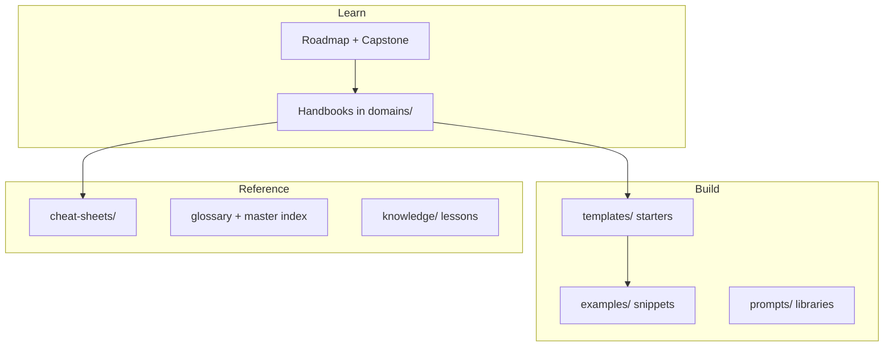
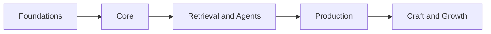

# AI Engineering Playbook

> A production handbook for **building, shipping, and operating** AI applications — not a research course, not a dump of notes.

This playbook is the internal-style documentation of an AI engineering team: handbooks you can learn from, templates you can copy, and references you can search.

---

## What this playbook is

| It is | It is not |
|-------|-----------|
| Practical guidance for LLM apps, RAG, agents, MCP, eval, and production | A deep-learning theory curriculum |
| Opinionated, production-minded defaults | A catalog of every AI tool ever made |
| Structured by **engineering domains** | Structured by hype frameworks |

**Audience:** AI engineers, backend engineers moving into AI, tech leads designing systems, and candidates preparing for AI engineering interviews.

---

## How the playbook is organized

Everything sits in a few clear layers. Learn the map once — then you always know where to look.

| Layer | Folder | What lives here |
|-------|--------|-----------------|
| **Handbooks** | `domains/` | Deep guides (RAG, agents, LLM, production…). Start at each folder’s `README.md`. |
| **Path** | `meta/roadmap.md` | Ordered learning path and milestones by capability. |
| **Capstone** | `meta/capstone-walkthrough.md` | One end-to-end build that stitches several handbooks together. |
| **Starters** | `templates/` | Copy-paste production scaffolds (FastAPI, RAG, agent, MCP, Docker, CI). |
| **Examples** | `examples/` | Small runnable scripts by topic. |
| **Prompts** | `prompts/` | Parameterized prompt templates. |
| **Quick ref** | `cheat-sheets/` | One-page cards for interviews and day-to-day work. |
| **Meta** | `meta/` | Glossary, indexes, style guide, architecture notes. |
| **Experience** | `knowledge/` | Lessons learned, ADRs, experiments (grows over time). |

**Rule of thumb**

1. **New topic?** Open the handbook under `domains/`.
2. **Need code today?** Open `templates/` or `examples/`.
3. **Need a reminder?** Open `cheat-sheets/` or the [glossary](meta/glossary.md).

---

## Three ways to use it

Pick **one** entry path — ignore the rest until you need them.

| Path | When | Start here |
|------|------|------------|
| **1. Learn in order** | You want a curriculum from foundations → production | [Learning Roadmap](meta/roadmap.md) |
| **2. Build something** | You want a working app this weekend | [Capstone: RAG Chat API](meta/capstone-walkthrough.md) |
| **3. Jump to a topic** | You already know what you need | [Handbooks below](#handbooks) or site search |

---

## Learning path (clear sequence)

Follow this order by **capability**. Each step has a handbook; finish the milestone before skipping ahead.

| # | Capability | Open this |
|---|------------|-----------|
| 0 | Hands-on first win (optional but recommended) | [Capstone walkthrough](meta/capstone-walkthrough.md) |
| 1 | Foundations — engineering, APIs, data | [Foundations](domains/foundations/README.md) · [Backend](domains/backend-engineering/README.md) · [FastAPI](domains/fastapi/README.md) · [Databases](domains/databases/README.md) |
| 2 | Core — LLM interaction | [LLM Engineering](domains/llm-engineering/README.md) · [Prompt Engineering](domains/prompt-engineering/README.md) · [Context Engineering](domains/context-engineering/README.md) |
| 3 | Retrieval & Agents | [RAG](domains/rag/README.md) · [AI Agents](domains/ai-agents/README.md) · [MCP](domains/mcp/README.md) |
| 4 | Production — quality & ops | [AI Evaluation](domains/ai-evaluation/README.md) · [AI System Design](domains/ai-system-design/README.md) · [Production AI](domains/ai-deployment/README.md) |
| 5 | Craft & Growth (as needed) | [AI Safety](domains/ai-safety/README.md) · [Debugging](domains/debugging/README.md) · [Interview Prep](domains/interview-preparation/README.md) · [Research Papers](domains/papers/README.md) |

Full detail (durations, milestones): **[Learning Roadmap](meta/roadmap.md)**

---

## Handbooks

Each link is a **module hub** (table of contents + learning path). Published modules only. Grouped by capability.

### Foundations

| Handbook | You will learn |
|----------|----------------|
| [Foundations](domains/foundations/README.md) | Lifecycle, Git, config, testing, practices |
| [Python Engineering](domains/python-engineering/README.md) | Async, typing, Pydantic, layout |
| [Backend Engineering](domains/backend-engineering/README.md) | Architecture, HTTP, validation, errors |
| [APIs](domains/apis/README.md) | REST, auth, streaming, rate limits |
| [FastAPI](domains/fastapi/README.md) | Routes, DI, AI endpoints |
| [Databases](domains/databases/README.md) | Postgres, Redis, pgvector, SQLAlchemy |

### Core (LLM Interaction)

| Handbook | You will learn |
|----------|----------------|
| [LLM Engineering](domains/llm-engineering/README.md) | Tokens, tools, providers, cost, streaming |
| [Prompt Engineering](domains/prompt-engineering/README.md) | Patterns, versioning, eval, security |
| [Context Engineering](domains/context-engineering/README.md) | Memory, ranking, compression, budgets |

### Retrieval & Agents

| Handbook | You will learn |
|----------|----------------|
| [RAG](domains/rag/README.md) | Chunking, retrieval, rerank, citations, eval |
| [AI Agents](domains/ai-agents/README.md) | Planning, tools, memory, frameworks |
| [MCP](domains/mcp/README.md) | Servers, clients, transports, security |

### Production

| Handbook | You will learn |
|----------|----------------|
| [AI Evaluation](domains/ai-evaluation/README.md) | Metrics, golden sets, CI gates |
| [AI System Design](domains/ai-system-design/README.md) | Architecture, scaling, case studies |
| [Production AI](domains/ai-deployment/README.md) | Docker, CI/CD, observability, incidents |

### Craft & Growth

| Handbook | You will learn |
|----------|----------------|
| [AI Safety](domains/ai-safety/README.md) | Injection, guardrails, safe tools |
| [Debugging](domains/debugging/README.md) | Triage for RAG, agents, and APIs |
| [Common Mistakes](domains/common-mistakes/common-engineering-mistakes.md) | 20 pitfalls with fixes |
| [Research Papers](domains/papers/README.md) | Engineering takeaways from key papers |
| [Interview Prep](domains/interview-preparation/README.md) | Coding, design, mocks, behavioral |

Planned / thin domains (workflows, cloud depth, …) are marked in [Domains Overview](domains/README.md) — prefer the published list above.

---

## Build toolkit

| Need | Go to |
|------|-------|
| Full starters | [Engineering Templates](templates/README.md) |
| FastAPI / RAG / Agent / MCP scaffolds | [templates/engineering/](templates/engineering/README.md) |
| Runnable snippets | [Examples](examples/README.md) |
| Prompt files | [Prompts](prompts/README.md) |

---

## Quick lookup

| Need | Go to |
|------|-------|
| One-page cards | [Cheat Sheets](cheat-sheets/README.md) |
| Term definitions | [Glossary](meta/glossary.md) |
| Every document listed | [Master Index](meta/indexes/MASTER-INDEX.md) |
| Site how-to | [Docs site guide](docs-site.md) |

---

## Contributing

1. Choose a [domain](domains/README.md) and a [document template](meta/templates/).
2. Follow the [style guide](meta/style-guide.md).
3. Register the doc in the domain README and [master index](meta/indexes/MASTER-INDEX.md).

---

## License

[MIT License](LICENSE)
