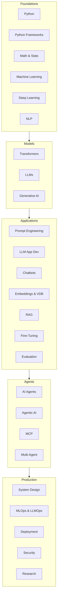
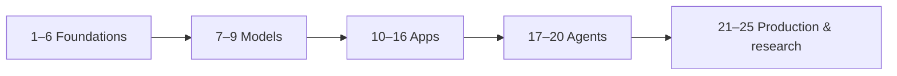

# AI Engineering Playbook

> A production handbook for **building, shipping, and operating** AI systems — from Python foundations through LLMs, RAG, agents, and production ops.

Click any topic to open its handbook. Each hub includes definitions, a learning path, diagrams, and linked deep dives.

---

## Topics

```mermaid
flowchart TB
  subgraph foundations [Foundations]
    P[Python]
    PF[Python Frameworks]
    MS[Math & Stats]
    ML[Machine Learning]
    DL[Deep Learning]
    NLP[NLP]
  end
  subgraph models [Models]
    TR[Transformers]
    LLM[LLMs]
    GEN[Generative AI]
  end
  subgraph apps [Applications]
    PE[Prompt Engineering]
    APP[LLM App Dev]
    CB[Chatbots]
    EMB[Embeddings & VDB]
    RAG[RAG]
    FT[Fine-Tuning]
    EV[Evaluation]
  end
  subgraph agents [Agents]
    AG[AI Agents]
    AA[Agentic AI]
    MCP[MCP]
    MAS[Multi-Agent]
  end
  subgraph prod [Production]
    SD[System Design]
    OPS[MLOps & LLMOps]
    DEP[Deployment]
    SEC[Security]
    RES[Research]
  end
  foundations --> models --> apps --> agents --> prod
```

| # | Topic | What you will learn |
|---|-------|---------------------|
| 1 | [Python](domains/python-engineering/README.md) | Production Python for AI — typing, async, structure |
| 2 | [Python Frameworks & Libraries](domains/python-frameworks-libraries/README.md) | FastAPI, data/ML stack, LLM SDKs |
| 3 | [Mathematics & Statistics](domains/mathematics-statistics/README.md) | Linear algebra, probability, eval stats |
| 4 | [Machine Learning](domains/machine-learning/README.md) | Classical ML loop, supervised learning, discipline |
| 5 | [Deep Learning](domains/deep-learning/README.md) | Neural nets, training, path to LMs |
| 6 | [Natural Language Processing](domains/natural-language-processing/README.md) | Tokenization, core tasks, NLP landscape |
| 7 | [Transformers](domains/transformers/README.md) | Attention, architecture, encoder vs decoder |
| 8 | [Large Language Models (LLMs)](domains/llm-engineering/README.md) | Tokens, APIs, tools, cost, streaming |
| 9 | [Generative AI](domains/generative-ai/README.md) | Modalities, productization, quality control |
| 10 | [Prompt Engineering](domains/prompt-engineering/README.md) | Patterns, versioning, eval, security |
| 11 | [LLM Application Development](domains/llm-application-development/README.md) | App architecture, orchestration, checklists |
| 12 | [Chatbots](domains/chatbots/README.md) | Dialogue, memory, grounded support bots |
| 13 | [Embeddings & Vector Databases](domains/embeddings-vector-databases/README.md) | Vectors, ANN search, choosing a stack |
| 14 | [RAG](domains/rag/README.md) | Chunking, retrieval, rerank, citations, eval |
| 15 | [LLM Fine-Tuning](domains/llm-fine-tuning/README.md) | When to FT, LoRA/QLoRA, data & gates |
| 16 | [LLM Evaluation](domains/ai-evaluation/README.md) | Metrics, golden sets, CI quality gates |
| 17 | [AI Agents](domains/ai-agents/README.md) | Planning, tools, memory, frameworks |
| 18 | [Agentic AI](domains/agentic-ai/README.md) | Autonomy levels, goal-directed systems |
| 19 | [MCP](domains/mcp/README.md) | Model Context Protocol — servers, clients, security |
| 20 | [Multi-Agent Systems](domains/multi-agent-systems/README.md) | Roles, coordination, when *not* to multi-agent |
| 21 | [AI System Design](domains/ai-system-design/README.md) | Architecture, scaling, case studies |
| 22 | [MLOps & LLMOps](domains/mlops-llmops/README.md) | Pipelines, versioning, feedback loops |
| 23 | [AI Deployment & Infrastructure](domains/ai-deployment/README.md) | Docker, CI/CD, serving, observability |
| 24 | [AI Security & Guardrails](domains/ai-security-guardrails/README.md) | Threat models, layered guards, secure tools |
| 25 | [Advanced AI Research](domains/advanced-ai-research/README.md) | Reading papers, research → production |

---

## Suggested learning order

Follow this path if you are building the skill stack from scratch. Jump anywhere if you already know what you need.

```mermaid
flowchart LR
  A[1–6 Foundations] --> B[7–9 Models]
  B --> C[10–16 Apps]
  C --> D[17–20 Agents]
  D --> E[21–25 Production & research]
```

| Stage | Topics |
|-------|--------|
| Foundations | 1 → 6 |
| Models | 7 → 9 |
| Applications | 10 → 16 |
| Agents | 17 → 20 |
| Production & research | 21 → 25 |

Hands-on path: **[Capstone: RAG Chat API](meta/capstone-walkthrough.md)** · Full curriculum notes: **[Learning Roadmap](meta/roadmap.md)**

---

## Also in this repo

| Need | Go to |
|------|-------|
| Starters (FastAPI, RAG, agent, MCP) | [templates/engineering/](templates/engineering/README.md) |
| Runnable snippets | [Examples](examples/README.md) |
| Prompt files | [Prompts](prompts/README.md) |
| One-page cards | [Cheat Sheets](cheat-sheets/README.md) |
| Term definitions | [Glossary](meta/glossary.md) |
| Every document | [Master Index](meta/indexes/MASTER-INDEX.md) |
| Extra domains (backend, FastAPI, debugging, interviews, …) | [Domains overview](domains/README.md) |
| Site how-to | [Docs site guide](docs-site.md) |

---

## Contributing

1. Choose a [domain](domains/README.md) and a [document template](meta/templates/).
2. Follow the [style guide](meta/style-guide.md).
3. Register the doc in the domain README and [master index](meta/indexes/MASTER-INDEX.md).

---

## License

[MIT License](LICENSE)
