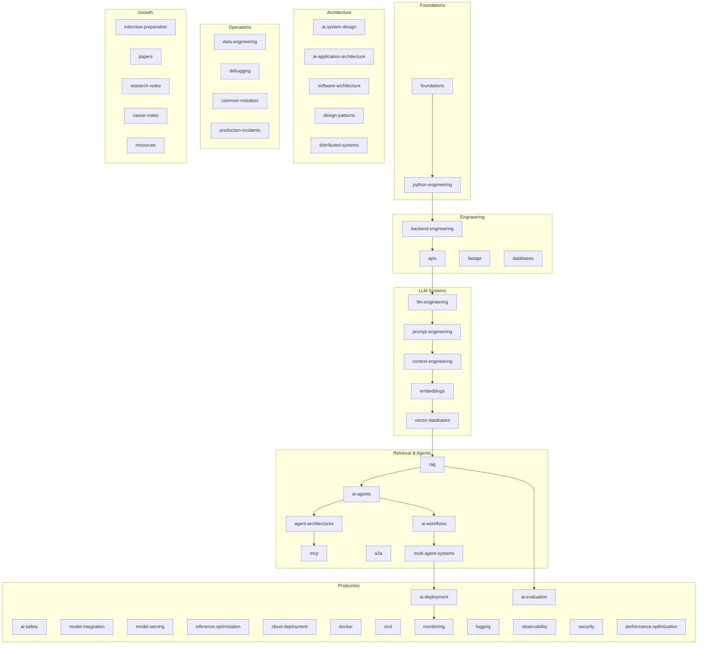

# Domains

> Knowledge organized by engineering domain — the core content of the AI Engineering Playbook.

---

## How Domains Work

Each domain represents an area of AI engineering knowledge. Domains are named for **concepts**, not technologies — so `vector-databases/` contains content about any vector database, and `ai-agents/` covers agent development regardless of framework.

Documents within a domain follow the [style guide](../meta/style-guide.md) and use [templates](../meta/templates/) appropriate to the content type.

---

## Domain Map

---

## All Domains

### Foundations

| Domain | Description |
|--------|-------------|
| [foundations](foundations/) | Core concepts and prerequisites |
| [python-engineering](python-engineering/) | Python for AI applications |

### Engineering

| Domain | Description |
|--------|-------------|
| [backend-engineering](backend-engineering/) | Backend patterns and service design |
| [apis](apis/) | API design for AI services |
| [fastapi](fastapi/) | FastAPI framework |
| [databases](databases/) | Database concepts and patterns |
| [databases/sql](databases/sql/) | SQL for AI applications |
| [databases/postgresql](databases/postgresql/) | PostgreSQL |
| [databases/redis](databases/redis/) | Redis caching and data store |

### LLM Systems

| Domain | Description |
|--------|-------------|
| [llm-engineering](llm-engineering/) | LLM integration and API usage |
| [prompt-engineering](prompt-engineering/) | Prompt design and optimization |
| [context-engineering](context-engineering/) | Context window and memory management |
| [embeddings](embeddings/) | Vector embeddings and chunking |
| [vector-databases](vector-databases/) | Vector storage and similarity search |

### Retrieval and Agents

| Domain | Description |
|--------|-------------|
| [rag](rag/) | Retrieval augmented generation |
| [ai-agents](ai-agents/) | AI agent development |
| [agent-architectures](agent-architectures/) | Agent system design patterns |
| [mcp](mcp/) | Model Context Protocol |
| [a2a](a2a/) | Agent-to-agent communication |
| [ai-workflows](ai-workflows/) | Workflow orchestration |
| [multi-agent-systems](multi-agent-systems/) | Multi-agent collaboration |

### Production

| Domain | Description |
|--------|-------------|
| [ai-evaluation](ai-evaluation/) | Evaluation and quality assurance |
| [ai-safety](ai-safety/) | Safety and guardrails |
| [model-integration](model-integration/) | Model selection and integration |
| [model-serving](model-serving/) | Model deployment and serving |
| [inference-optimization](inference-optimization/) | Inference performance |
| [ai-deployment](ai-deployment/) | Production deployment |
| [cloud-deployment](cloud-deployment/) | Cloud deployment strategies |
| [docker](docker/) | Containerization |
| [cicd](cicd/) | CI/CD pipelines |
| [monitoring](monitoring/) | Monitoring and alerting |
| [logging](logging/) | Structured logging |
| [observability](observability/) | Tracing and telemetry |
| [security](security/) | Security practices |
| [performance-optimization](performance-optimization/) | Performance tuning |

### Architecture

| Domain | Description |
|--------|-------------|
| [ai-system-design](ai-system-design/) | End-to-end system design |
| [ai-application-architecture](ai-application-architecture/) | Application architecture |
| [software-architecture](software-architecture/) | Software architecture principles |
| [design-patterns](design-patterns/) | Reusable design patterns |
| [distributed-systems](distributed-systems/) | Distributed system concepts |

### Operations

| Domain | Description |
|--------|-------------|
| [data-engineering](data-engineering/) | Data pipelines for AI |
| [debugging](debugging/) | Debugging AI applications |
| [common-mistakes](common-mistakes/) | Mistakes and prevention |
| [production-incidents](production-incidents/) | Incident postmortems |

### Growth

| Domain | Description |
|--------|-------------|
| [interview-preparation](interview-preparation/) | Interview preparation |
| [papers](papers/) | Research paper summaries |
| [research-notes](research-notes/) | Research notes |
| [career-notes](career-notes/) | Career development |
| [resources](resources/) | External resources |

---

## Adding a New Domain

See [CONTRIBUTING.md](../CONTRIBUTING.md#adding-a-new-domain). New domains are created only for genuinely new areas of AI engineering knowledge.

---

## See Also

- [Master Index](../meta/indexes/MASTER-INDEX.md)
- [Learning Roadmap](../meta/roadmap.md)
- [Architecture Overview](../meta/architecture-overview.md)
