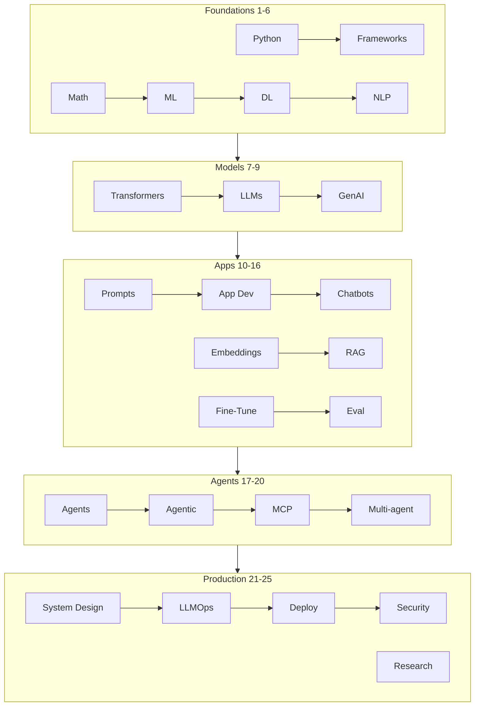

# Domains

> Knowledge organized by engineering domain — the core content of the AI Engineering Playbook.

The **home page lists 25 primary topics**. This page is the full inventory (primary + supporting domains).

**Status legend:** **Published** = substantive docs beyond the README · **Planned** = folder reserved, content still to come.

---

## Primary topics (25)

| # | Domain | Description | Status |
|---|--------|-------------|--------|
| 1 | [python-engineering](python-engineering/) | Python for AI applications | Published |
| 2 | [python-frameworks-libraries](python-frameworks-libraries/) | Web, data/ML, and LLM library stack | Published |
| 3 | [mathematics-statistics](mathematics-statistics/) | Linear algebra, probability, eval stats | Published |
| 4 | [machine-learning](machine-learning/) | Classical ML foundations | Published |
| 5 | [deep-learning](deep-learning/) | Neural nets and training | Published |
| 6 | [natural-language-processing](natural-language-processing/) | Tokenization and core NLP tasks | Published |
| 7 | [transformers](transformers/) | Attention and transformer architecture | Published |
| 8 | [llm-engineering](llm-engineering/) | Large language models | Published |
| 9 | [generative-ai](generative-ai/) | Generative systems and productization | Published |
| 10 | [prompt-engineering](prompt-engineering/) | Prompt design and optimization | Published |
| 11 | [llm-application-development](llm-application-development/) | Building LLM-backed applications | Published |
| 12 | [chatbots](chatbots/) | Conversational products | Published |
| 13 | [embeddings-vector-databases](embeddings-vector-databases/) | Embeddings and vector search | Published |
| 14 | [rag](rag/) | Retrieval-augmented generation | Published |
| 15 | [llm-fine-tuning](llm-fine-tuning/) | Adapting LLM weights | Published |
| 16 | [ai-evaluation](ai-evaluation/) | LLM / system evaluation | Published |
| 17 | [ai-agents](ai-agents/) | Agent development | Published |
| 18 | [agentic-ai](agentic-ai/) | Autonomy and goal-directed systems | Published |
| 19 | [mcp](mcp/) | Model Context Protocol | Published |
| 20 | [multi-agent-systems](multi-agent-systems/) | Multi-agent coordination | Published |
| 21 | [ai-system-design](ai-system-design/) | AI system architecture | Published |
| 22 | [mlops-llmops](mlops-llmops/) | MLOps and LLMOps | Published |
| 23 | [ai-deployment](ai-deployment/) | Deployment and infrastructure | Published |
| 24 | [ai-security-guardrails](ai-security-guardrails/) | Security and guardrails | Published |
| 25 | [advanced-ai-research](advanced-ai-research/) | Research → engineering practice | Published |

```mermaid
flowchart TB
  subgraph F [Foundations 1-6]
    PY[Python] --> PF[Frameworks]
    MS[Math] --> ML[ML] --> DL[DL] --> NLP[NLP]
  end
  subgraph M [Models 7-9]
    TR[Transformers] --> LLM[LLMs] --> GEN[GenAI]
  end
  subgraph A [Apps 10-16]
    PE[Prompts] --> APP[App Dev] --> CB[Chatbots]
    EMB[Embeddings] --> RAG[RAG]
    FT[Fine-Tune] --> EV[Eval]
  end
  subgraph G [Agents 17-20]
    AG[Agents] --> AA[Agentic] --> MCP[MCP] --> MAS[Multi-agent]
  end
  subgraph P [Production 21-25]
    SD[System Design] --> OPS[LLMOps] --> DEP[Deploy] --> SEC[Security]
    RES[Research]
  end
  F --> M --> A --> G --> P
```

---

## Supporting domains

These remain available for deeper engineering topics not on the primary 25 list.

### Application & platform

| Domain | Description | Status |
|--------|-------------|--------|
| [foundations](foundations/) | Engineering lifecycle prerequisites | Published |
| [backend-engineering](backend-engineering/) | Backend patterns and service design | Published |
| [apis](apis/) | API design for AI services | Published |
| [fastapi](fastapi/) | FastAPI framework | Published |
| [databases](databases/) | Database concepts and patterns | Published |
| [context-engineering](context-engineering/) | Context window and memory management | Published |
| [security](security/) | General security practices | Published |
| [ai-safety](ai-safety/) | Safety deep dive (pairs with topic 24) | Published |

### Ops & infrastructure (stubs / partial)

| Domain | Description | Status |
|--------|-------------|--------|
| [docker](docker/) | Containers | Planned |
| [cicd](cicd/) | CI/CD | Planned |
| [cloud-deployment](cloud-deployment/) | Cloud deploy | Planned |
| [model-serving](model-serving/) | Model serving | Planned |
| [inference-optimization](inference-optimization/) | Inference optimization | Planned |
| [monitoring](monitoring/) | Monitoring | Planned |
| [logging](logging/) | Logging | Planned |
| [observability](observability/) | Observability | Planned |

### Agents / architecture (pointers)

| Domain | Description | Status |
|--------|-------------|--------|
| [embeddings](embeddings/) | Pointer → topic 13 | Published |
| [vector-databases](vector-databases/) | Pointer → topic 13 | Published |
| [agent-architectures](agent-architectures/) | Agent architecture patterns | Planned |
| [a2a](a2a/) | Agent-to-agent protocols | Planned |
| [ai-workflows](ai-workflows/) | Workflow orchestration | Planned |

### Craft & growth

| Domain | Description | Status |
|--------|-------------|--------|
| [debugging](debugging/) | Debugging AI systems | Published |
| [common-mistakes](common-mistakes/) | Common pitfalls | Published |
| [papers](papers/) | Paper notes (pairs with topic 25) | Published |
| [interview-preparation](interview-preparation/) | Interview prep | Published |
| [research-notes](research-notes/) | Research scratchpad | Planned |
| [career-notes](career-notes/) | Career notes | Planned |
| [resources](resources/) | External resources | Planned |

---

## How domains work

Each domain is named for a **concept**, not a single vendor. Documents follow the [style guide](../meta/style-guide.md) and [templates](../meta/templates/).

Start from the [home page topics](../README.md#topics) unless you need a supporting domain above.
