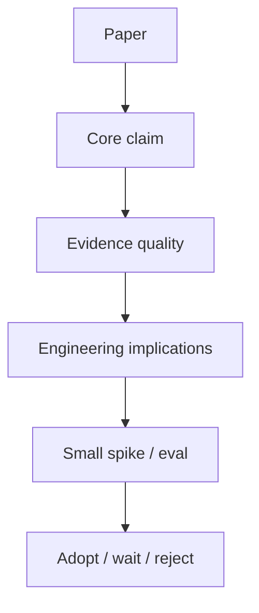

# Advanced AI Research

> Engineering takeaways from papers and emerging research — how to read, extract, and apply ideas without chasing hype.

**Prerequisites:** [Transformers](../transformers/README.md) · [Large Language Models](../llm-engineering/README.md)  
**Unlocks:** [AI System Design](../ai-system-design/README.md) · [Agentic AI](../agentic-ai/README.md)

---

## Definition

**Advanced AI research** (in this playbook) means tracking papers and results that change engineering practice: architectures, training methods, retrieval, agents, eval, and safety. Focus on reproducible takeaways and system implications — not paper collecting.

---

## Learning path

---

## Documents

| # | Topic | Document |
|---|-------|----------|
| 1 | How to read AI papers | [how-to-read-ai-papers.md](how-to-read-ai-papers.md) |
| 2 | Research to production | [research-to-production.md](research-to-production.md) |
| 3 | Watchlist themes | [research-watchlist.md](research-watchlist.md) |

---

## Related topics

- [Research papers handbook](../papers/README.md)
- [Research notes](../research-notes/README.md)
- [Interview preparation](../interview-preparation/README.md)

---

## See also

- [Domains overview](../README.md)
- [Learning Roadmap](../../meta/roadmap.md)
- [Master Index](../../meta/indexes/MASTER-INDEX.md)
