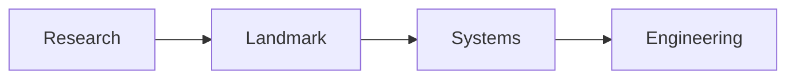

# Advanced AI Research

> How to read papers, landmark results, systems research, and engineering takeaways.

**Prerequisites:** [Transformers](../transformers/README.md) · [LLMs](../llm-engineering/README.md)  
**Unlocks:** [AI System Design](../ai-system-design/README.md)

Start with a section hub below (or expand the topic in the left sidebar).

---

## Sections

| # | Section | What you will learn | Hub |
|---|---------|---------------------|-----|
| 1 | **Research Craft** | Research section | [research-craft/](research-craft/README.md) |
| 2 | **Landmark Papers** | Research section | [landmark-papers/](landmark-papers/README.md) |
| 3 | **Systems Papers** | Research section | [systems-papers/](systems-papers/README.md) |
| 4 | **Engineering Takeaways** | Research section | [engineering-takeaways/](engineering-takeaways/README.md) |

---

## Hierarchy

### Research Craft

| # | Topic |
|---|-------|
| 1 | [How To Read Ai Papers](research-craft/01-how-to-read-ai-papers.md) |
| 2 | [Research To Production](research-craft/02-research-to-production.md) |
| 3 | [Research Watchlist](research-craft/03-research-watchlist.md) |

### Landmark Papers

| # | Topic |
|---|-------|
| 1 | [Attention Is All You Need](landmark-papers/01-attention-is-all-you-need.md) |
| 2 | [Prompt Engineering Papers](landmark-papers/02-prompt-engineering-papers.md) |
| 3 | [Retrieval Papers](landmark-papers/03-retrieval-papers.md) |
| 4 | [Agent Reasoning Papers](landmark-papers/04-agent-reasoning-papers.md) |

### Systems Papers

| # | Topic |
|---|-------|
| 1 | [Dspy](systems-papers/01-dspy.md) |
| 2 | [Swe Agent](systems-papers/02-swe-agent.md) |
| 3 | [Research Evolution](systems-papers/03-research-evolution.md) |

### Engineering Takeaways

| # | Topic |
|---|-------|
| 1 | [Engineering Takeaways](engineering-takeaways/01-engineering-takeaways.md) |
| 2 | [Research Comparison Guides](engineering-takeaways/02-research-comparison-guides.md) |
| 3 | [Future Research](engineering-takeaways/03-future-research.md) |

---

## Definition

**Advanced AI research** for engineers: reading papers critically and converting ideas into production experiments.

---

## Related topics

- [Domains overview](../README.md)
- [Master Index](../../meta/indexes/MASTER-INDEX.md)
