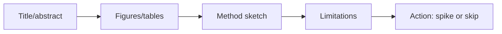

# How to Read AI Papers

> A practical reading method for busy engineers.

## Definition

Read for decisions: problem, method, results, limitations, and what you would change in a production system. Skim figures/tables first; inspect baselines and ablations before believing headlines.

## Why it matters

Hype cycles punish shallow reading. A 20-minute structured pass beats a 2-hour unfocused one.

## How it works

## Key principles

1. **Demand baselines** — Vs strong simple methods.
2. **Mind distribution shift** — Benchmarks ≠ your traffic.
3. **Write a 5-line note** — Claim / why care / next test.

## Common applications

| Application | Description |
|-------------|-------------|
| Architecture ideas | Attention variants |
| RAG methods | New retrievers/rerankers |
| Eval protocols | Better measurement |

## Common mistakes

- Implementing from abstract only
- Ignoring compute costs in 'SOTA' claims

## Further reading

- [Papers](../papers/README.md)
- [Research to production](research-to-production.md)
