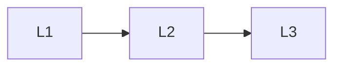

# Research Craft

> Section of the **advanced-ai-research** handbook.

## Lessons

| # | Lesson |
|---|--------|
| 1 | [How To Read Ai Papers](01-how-to-read-ai-papers.md) |
| 2 | [Research To Production](02-research-to-production.md) |
| 3 | [Research Watchlist](03-research-watchlist.md) |

**Topic hub:** [../README.md](../README.md)
