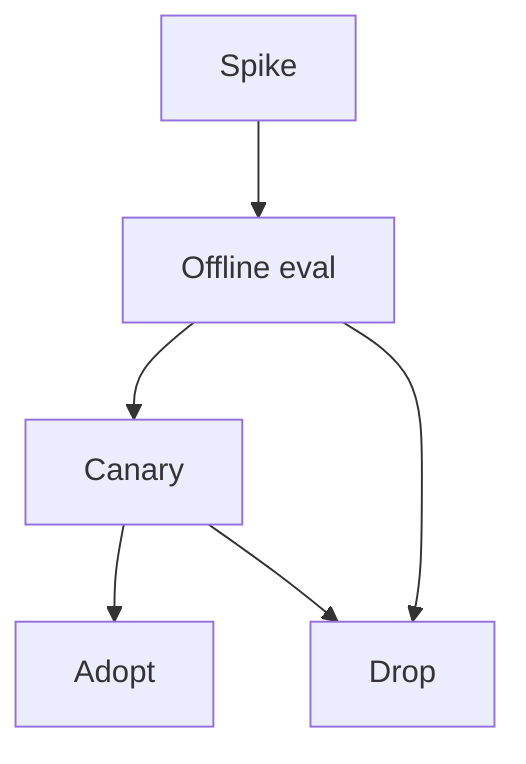

# Research to Production

> How to trial paper ideas safely in real systems.

## Definition

Promote research through a funnel: reproduce toy result → offline eval on your data → limited online canary → adopt with monitoring. Keep an explicit kill criterion.

## Why it matters

Most paper gains vanish on real data. The funnel protects users and calendars.

## How it works

## Key principles

1. **Your data or it didn't happen** — Internal golden sets.
2. **Measure full system** — Not isolated toy metric.
3. **Complexity tax** — Ops cost counts against gains.

## Common applications

| Application | Description |
|-------------|-------------|
| New chunking | RAG A/B |
| New decoding | Latency/quality trade |
| Agent planners | Trajectory eval |

## Common mistakes

- Rewriting production on one viral paper
- No rollback after 'temporary' research feature

## Further reading

- [MLOps & LLMOps](../mlops-llmops/README.md)
- [LLM Evaluation](../ai-evaluation/README.md)
