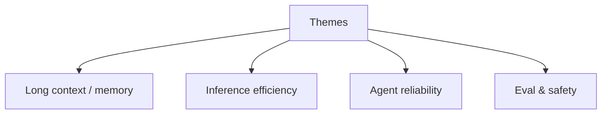

# Research Watchlist

> Themes worth tracking for AI application engineers.

## Definition

A living watchlist of themes: long context vs retrieval, efficient inference, agent reliability, multimodal, eval methodology, and safety/security. Track themes, not every arXiv ID.

## Why it matters

Focus beats FOMO. Theme tracking maps research to your roadmap.

## How it works

## Key principles

1. **Map to roadmap** — Ignore unrelated SOTA.
2. **Prefer surveys + reproductions** — Signal over noise.
3. **Revisit quarterly** — Update adopt/wait lists.

## Common applications

| Application | Description |
|-------------|-------------|
| Platform teams | Inference efficiency |
| Product AI | Agent reliability |
| Risk | Security papers |

## Common mistakes

- Rewriting stack every conference cycle
- Tracking models only, never eval methods

## Further reading

- [Papers](../papers/README.md)
- [Advanced AI Research hub](README.md)
