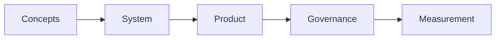

# Agentic AI

> AI systems that plan and act toward goals — nested Handbooks curriculum from concepts through governance and measurement.

**Prerequisites:** [AI Agents](../ai-agents/README.md) · [LLM Application Development](../llm-application-development/README.md)  
**Unlocks:** [Multi-Agent Systems](../multi-agent-systems/README.md) · [AI Evaluation](../ai-evaluation/README.md)

Start with a section hub below (or expand the topic in the left sidebar).

---

## Sections

| # | Section | What you will learn | Hub |
|---|---------|---------------------|-----|
| 1 | **Concepts** | Chat vs agentic, autonomy levels, and the core loop | [concepts/](concepts/README.md) |
| 2 | **System Design** | Goals, planners, world state, and end-to-end design | [system-design/](system-design/README.md) |
| 3 | **Product Patterns** | Research, coding, and ops agent patterns | [product-patterns/](product-patterns/README.md) |
| 4 | **Governance** | Budgets, kill switches, audit, policy, oversight | [governance/](governance/README.md) |
| 5 | **Measurement** | Task success, trajectory eval, online monitoring | [measurement/](measurement/README.md) |

---

## Hierarchy

### Concepts

| # | Topic |
|---|-------|
| 1 | [Agentic AI vs Chatbots](concepts/01-agentic-vs-chatbot.md) |
| 2 | [Autonomy Levels](concepts/02-autonomy-levels.md) |
| 3 | [The Agentic Loop](concepts/03-agentic-loop.md) |

### System Design

| # | Topic |
|---|-------|
| 1 | [Designing Agentic Systems](system-design/01-designing-agentic-systems.md) |
| 2 | [Goals and Planners](system-design/02-goals-and-planners.md) |
| 3 | [World State and Memory](system-design/03-world-state-and-memory.md) |

### Product Patterns

| # | Topic |
|---|-------|
| 1 | [Research Agents](product-patterns/01-research-agents.md) |
| 2 | [Coding Agents](product-patterns/02-coding-agents.md) |
| 3 | [Ops Agents](product-patterns/03-ops-agents.md) |

### Governance

| # | Topic |
|---|-------|
| 1 | [Budgets and Kill Switches](governance/01-budgets-and-kill-switches.md) |
| 2 | [Audit and Policy](governance/02-audit-and-policy.md) |
| 3 | [Human Oversight](governance/03-human-oversight.md) |

### Measurement

| # | Topic |
|---|-------|
| 1 | [Task Success Metrics](measurement/01-task-success.md) |
| 2 | [Trajectory Evaluation](measurement/02-trajectory-eval.md) |
| 3 | [Online Monitoring for Agents](measurement/03-online-monitoring.md) |

---

## Definition

**Agentic AI** is goal-directed autonomy: planning, tool use, durable state, and oversight under budgets — beyond single-turn chatbots.

---

## Related topics

- [AI Agents](../ai-agents/README.md)
- [AI Evaluation](../ai-evaluation/README.md)
- [Multi-Agent Systems](../multi-agent-systems/README.md)
- [Domains overview](../README.md)
- [Master Index](../../meta/indexes/MASTER-INDEX.md)
