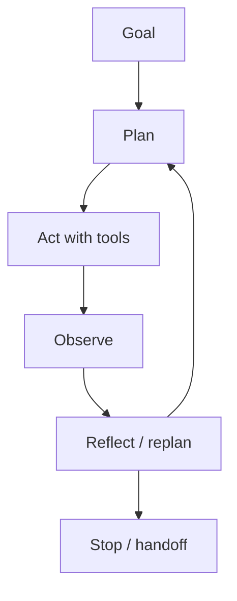

# Agentic AI

> AI systems that plan and act toward goals — the shift from single responses to autonomous workflows with oversight.

**Prerequisites:** [AI Agents](../ai-agents/README.md) · [LLM Application Development](../llm-application-development/README.md)  
**Unlocks:** [Multi-Agent Systems](../multi-agent-systems/README.md) · [MCP](../mcp/README.md)

---

## Definition

**Agentic AI** describes systems that pursue goals via planning, tool use, memory, and iterative self-correction — with more autonomy than a single prompt/response. It is a product/architecture stance: how much initiative the system may take, under what budgets and permissions.

---

## Learning path

---

## Documents

| # | Topic | Document |
|---|-------|----------|
| 1 | Agentic vs chatbot | [agentic-vs-chatbot.md](agentic-vs-chatbot.md) |
| 2 | Autonomy levels | [autonomy-levels.md](autonomy-levels.md) |
| 3 | Designing agentic systems | [designing-agentic-systems.md](designing-agentic-systems.md) |

---

## Related topics

- [AI Agents](../ai-agents/README.md)
- [AI Workflows](../ai-workflows/README.md)
- [Agent architectures](../agent-architectures/README.md)

---

## See also

- [Domains overview](../README.md)
- [Learning Roadmap](../../meta/roadmap.md)
- [Master Index](../../meta/indexes/MASTER-INDEX.md)
