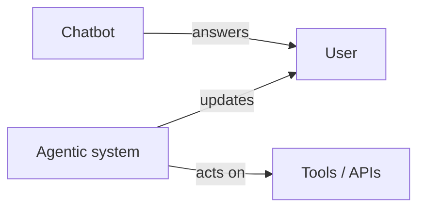

# Agentic AI vs Chatbots

> Where conversation ends and goal-directed agency begins.

## Definition

Chatbots primarily converse; agentic systems primarily accomplish tasks — often using conversation as one interface. Agentic systems maintain goals, call tools, and continue across steps without a human prompt each time.

## Why it matters

Calling every chatbot 'an agent' blurs threat models and UX. Autonomy must be explicit.

## How it works

## Key principles

1. **Name the autonomy** — What can it do without asking?
2. **Prefer workflows when steps are known** — Agents for uncertainty.
3. **Human approval for side effects** — Especially money/data changes.

## Common applications

| Application | Description |
|-------------|-------------|
| Research assistants | Browse + summarize + draft |
| Ops automation | Diagnose + open tickets |
| Coding agents | Edit + test loops |

## Common mistakes

- Unlimited production credentials for 'agents'
- No stop conditions

## Further reading

- [Autonomy levels](autonomy-levels.md)
- [Chatbots](../chatbots/README.md)
