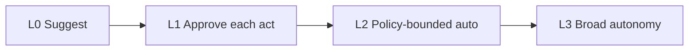

# Autonomy Levels

> A practical scale for how much initiative to grant.

## Definition

Autonomy levels range from suggest-only → act-with-approval → act-within-policy → fully autonomous in a sandbox. Each level needs matching monitoring, authz, and rollback.

## Why it matters

Most enterprises should climb levels deliberately. Skipping to high autonomy is how incidents happen.

## How it works

## Key principles

1. **Bound the blast radius** — Sandbox + least privilege.
2. **Budget steps** — Max tools/tokens/time.
3. **Audit everything** — Who did what, why.

## Common applications

| Application | Description |
|-------------|-------------|
| Draft emails | L0/L1 |
| Label tickets | L2 |
| Closed-loop remediation | L2/L3 with strong gates |

## Common mistakes

- L3 autonomy on production write APIs on day one
- No kill switch

## Further reading

- [Designing agentic systems](designing-agentic-systems.md)
- [AI Security & Guardrails](../ai-security-guardrails/README.md)
