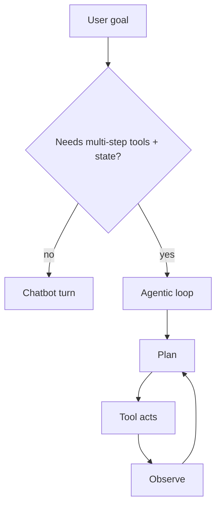

# Agentic AI vs Chatbots

> Where conversation ends and goal-directed agency begins: chatbots answer turns; agentic systems pursue goals with tools, memory, and control loops under oversight.

## Table of Contents

- [Overview](#overview)
- [Definition](#definition)
- [Why It Matters](#why-it-matters)
- [Uses](#uses)
- [How It Works](#how-it-works)
- [Worked Example](#worked-example)
- [Python Examples](#python-examples)
- [Production Considerations](#production-considerations)
- [Performance Considerations](#performance-considerations)
- [Cost Considerations](#cost-considerations)
- [Security Considerations](#security-considerations)
- [Best Practices](#best-practices)
- [Common Mistakes](#common-mistakes)
- [Interview Preparation](#interview-preparation)
- [Navigation](#navigation)

---

## Overview

This lesson covers **Agentic AI vs Chatbots** inside the `concepts` section of the `agentic-ai` handbook. Treat it as production engineering guidance: clear definitions, when to apply the idea, system shape, and code you can adapt.

---

## Definition

**Agentic AI vs Chatbots** — Where conversation ends and goal-directed agency begins: chatbots answer turns; agentic systems pursue goals with tools, memory, and control loops under oversight.

---

## Why It Matters

Teams often rebrand a tool-calling chatbot as an agent and then hit cost, safety, and reliability walls. Drawing a sharp line between conversational UX and agentic control prevents wrong architecture, wrong evals, and wrong customer promises.

Without a clear model for this topic, teams ship demos that fail under load, cost, or correctness pressure.

---

## Uses

| Use case | How this applies |
|----------|------------------|
| Support deflect | Chatbot for FAQ; agentic for multi-step account actions with approval |
| Internal ops | Agentic runbooks that call APIs and file tickets |
| Research assistants | Agentic browse/retrieve/synthesize loops vs single-shot chat |
| Coding copilots | Chat for Q&A; agentic for edit-test-fix loops |

---

## How It Works

A chatbot maps user message → model → reply (optionally one tool). An agentic system maps goal → plan → act → observe under budgets, with durable state and policy gates. Product copy, SLAs, and evals must match the mode you actually ship.



---

## Worked Example

A bank ships 'AI assistant.' FAQ answers stay chatbot. 'Dispute this charge and notify me' becomes agentic: verify identity (code), fetch transactions (tool), draft dispute (model), require human confirm for submit (policy), then track status (memory).

---

## Python Examples

```python
from dataclasses import dataclass, field
from enum import Enum
from typing import Any

class Mode(Enum):
    CHATBOT = "chatbot"
    AGENTIC = "agentic"

@dataclass
class TurnRequest:
    user_text: str
    needs_multi_step: bool
    needs_write_tools: bool
    needs_durable_state: bool

@dataclass
class RouteDecision:
    mode: Mode
    reasons: list[str] = field(default_factory=list)

def route_mode(req: TurnRequest) -> RouteDecision:
    reasons = []
    if req.needs_write_tools:
        reasons.append("write_tools")
    if req.needs_multi_step:
        reasons.append("multi_step")
    if req.needs_durable_state:
        reasons.append("durable_state")
    if reasons:
        return RouteDecision(Mode.AGENTIC, reasons)
    return RouteDecision(Mode.CHATBOT, ["single_turn_ok"])

def chatbot_reply(llm, messages: list[dict]) -> str:
    return llm.complete(messages, tools=None, max_tokens=512)

def agentic_run(orchestrator, goal: str, budget: dict[str, Any]) -> dict:
    return orchestrator.run(goal=goal, max_steps=budget["max_steps"],
                            max_usd=budget["max_usd"], require_approval=budget.get("approval", True))

```

---

## Production Considerations

- Log request IDs across orchestration steps.
- Fail closed on auth and policy; degrade only where product explicitly allows it.
- Keep feature flags for prompt/model swaps.

## Performance Considerations

- Bound concurrency to the model provider.
- Stream when UX needs time-to-first-token.
- Cache stable sub-results carefully with invalidation rules.

## Cost Considerations

- Track tokens and tool calls per feature / tenant.
- Prefer smaller models for routers and classifiers.
- Cap max tokens and tool-loop iterations.

## Security Considerations

- Never put secrets in prompts.
- Treat model output as untrusted until validated.
- Enforce tenant isolation on retrieval and tools.

---

## Best Practices

1. Prefer explicit interfaces over prompt-only business logic.
2. Measure latency, cost, and quality together on every agent run.
3. Keep prompts, tool schemas, and configs versioned as one artifact.
4. Bound tool loops with max steps, wall-clock, and dollar budgets.
5. Log structured trajectories so failures are debuggable offline.

---

## Common Mistakes

- Shipping without golden trajectory evals.
- Hiding critical state only inside the model context window.
- No timeouts or budget limits on model or tool calls.
- Granting write tools before read-only autonomy is proven.
- Treating a chatbot with one tool as a production agentic system.

---

## Interview Preparation

**Q: How is agentic AI different from a chatbot?**

A: Chatbots optimize turn quality; agentic systems optimize goal completion via planning, tools, memory, and oversight under budgets.

**Q: What belongs in code vs the planner prompt?**

A: Auth, billing, validation, allow-lists, and kill-switches stay in code; stylistic planning heuristics can live in prompts.

**Q: How do you roll out higher autonomy safely?**

A: Start read-only, shadow write actions, gate on trajectory evals, canary a tenant slice, keep one-click rollback to lower autonomy.

---

## Navigation

- **Section hub:** [README](README.md)
- **Topic hub:** [../README.md](../README.md)
