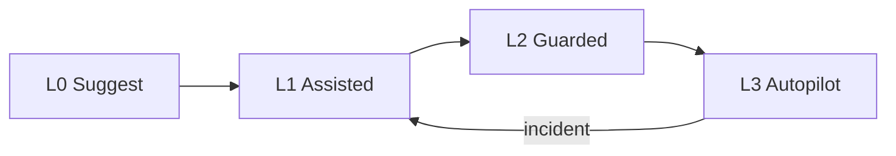

# Autonomy Levels

> A practical scale for how much initiative to grant an agent — from suggest-only through supervised actions to guarded autopilot — tied to risk, tools, and oversight.

## Table of Contents

- [Overview](#overview)
- [Definition](#definition)
- [Why It Matters](#why-it-matters)
- [Uses](#uses)
- [How It Works](#how-it-works)
- [Worked Example](#worked-example)
- [Python Examples](#python-examples)
- [Production Considerations](#production-considerations)
- [Performance Considerations](#performance-considerations)
- [Cost Considerations](#cost-considerations)
- [Security Considerations](#security-considerations)
- [Best Practices](#best-practices)
- [Common Mistakes](#common-mistakes)
- [Interview Preparation](#interview-preparation)
- [Navigation](#navigation)

---

## Overview

This lesson covers **Autonomy Levels** inside the `concepts` section of the `agentic-ai` handbook. Treat it as production engineering guidance: clear definitions, when to apply the idea, system shape, and code you can adapt.

---

## Definition

**Autonomy Levels** — A practical scale for how much initiative to grant an agent — from suggest-only through supervised actions to guarded autopilot — tied to risk, tools, and oversight.

---

## Why It Matters

Autonomy is a product and risk decision, not a model capability flex. Clear levels let you ship value early, expand write access with evidence, and explain behavior to compliance and customers.

Without a clear model for this topic, teams ship demos that fail under load, cost, or correctness pressure.

---

## Uses

| Use case | How this applies |
|----------|------------------|
| L0 suggest | Draft only; human executes |
| L1 assisted | Agent proposes tool calls; human approves each |
| L2 guarded | Agent executes allow-listed reads; writes need approval |
| L3 autopilot | Agent executes within budgets and policy without per-step approval |

---

## How It Works

Map each tool to a minimum autonomy level. Promotion requires eval gates, blast-radius limits, and kill-switches. Demote automatically on policy violations or cost anomalies.



---

## Worked Example

Incident response agent: L2 can query logs and open draft tickets; submitting severity-1 changes requires L1 approval. After 30 green days and eval pass, promote log queries to L3.

---

## Python Examples

```python
from enum import IntEnum
from dataclasses import dataclass

class Autonomy(IntEnum):
    L0_SUGGEST = 0
    L1_ASSISTED = 1
    L2_GUARDED = 2
    L3_AUTOPILOT = 3

@dataclass
class ToolPolicy:
    name: str
    min_level: Autonomy
    is_write: bool

TOOLS = [
    ToolPolicy("search_docs", Autonomy.L2_GUARDED, False),
    ToolPolicy("create_ticket_draft", Autonomy.L1_ASSISTED, True),
    ToolPolicy("submit_ticket", Autonomy.L1_ASSISTED, True),
    ToolPolicy("restart_service", Autonomy.L1_ASSISTED, True),
]

def may_execute(level: Autonomy, tool: ToolPolicy, human_approved: bool) -> bool:
    if level < tool.min_level:
        return False
    if tool.is_write and level < Autonomy.L3_AUTOPILOT and not human_approved:
        return False
    if tool.is_write and level == Autonomy.L3_AUTOPILOT:
        return tool.name in {"create_ticket_draft"}  # still narrow writes
    return True

def promote(current: Autonomy, eval_pass: bool, days_green: int) -> Autonomy:
    if not eval_pass or days_green < 14:
        return current
    return Autonomy(min(int(current) + 1, int(Autonomy.L3_AUTOPILOT)))

```

---

## Production Considerations

- Log request IDs across orchestration steps.
- Fail closed on auth and policy; degrade only where product explicitly allows it.
- Keep feature flags for prompt/model swaps.

## Performance Considerations

- Bound concurrency to the model provider.
- Stream when UX needs time-to-first-token.
- Cache stable sub-results carefully with invalidation rules.

## Cost Considerations

- Track tokens and tool calls per feature / tenant.
- Prefer smaller models for routers and classifiers.
- Cap max tokens and tool-loop iterations.

## Security Considerations

- Never put secrets in prompts.
- Treat model output as untrusted until validated.
- Enforce tenant isolation on retrieval and tools.

---

## Best Practices

1. Prefer explicit interfaces over prompt-only business logic.
2. Measure latency, cost, and quality together on every agent run.
3. Keep prompts, tool schemas, and configs versioned as one artifact.
4. Bound tool loops with max steps, wall-clock, and dollar budgets.
5. Log structured trajectories so failures are debuggable offline.

---

## Common Mistakes

- Shipping without golden trajectory evals.
- Hiding critical state only inside the model context window.
- No timeouts or budget limits on model or tool calls.
- Granting write tools before read-only autonomy is proven.
- Treating a chatbot with one tool as a production agentic system.

---

## Interview Preparation

**Q: How is agentic AI different from a chatbot?**

A: Chatbots optimize turn quality; agentic systems optimize goal completion via planning, tools, memory, and oversight under budgets.

**Q: What belongs in code vs the planner prompt?**

A: Auth, billing, validation, allow-lists, and kill-switches stay in code; stylistic planning heuristics can live in prompts.

**Q: How do you roll out higher autonomy safely?**

A: Start read-only, shadow write actions, gate on trajectory evals, canary a tenant slice, keep one-click rollback to lower autonomy.

---

## Navigation

- **Section hub:** [README](README.md)
- **Topic hub:** [../README.md](../README.md)
