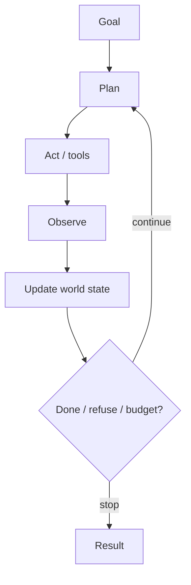

# The Agentic Loop

> The core control loop of plan → act → observe → update state, repeated until the goal is met, refused, or a budget/kill-switch stops the run.

## Table of Contents

- [Overview](#overview)
- [Definition](#definition)
- [Why It Matters](#why-it-matters)
- [Uses](#uses)
- [How It Works](#how-it-works)
- [Worked Example](#worked-example)
- [Python Examples](#python-examples)
- [Production Considerations](#production-considerations)
- [Performance Considerations](#performance-considerations)
- [Cost Considerations](#cost-considerations)
- [Security Considerations](#security-considerations)
- [Best Practices](#best-practices)
- [Common Mistakes](#common-mistakes)
- [Interview Preparation](#interview-preparation)
- [Navigation](#navigation)

---

## Overview

This lesson covers **The Agentic Loop** inside the `concepts` section of the `agentic-ai` handbook. Treat it as production engineering guidance: clear definitions, when to apply the idea, system shape, and code you can adapt.

---

## Definition

**The Agentic Loop** — The core control loop of plan → act → observe → update state, repeated until the goal is met, refused, or a budget/kill-switch stops the run.

---

## Why It Matters

Without an explicit loop, 'agents' become unbounded chat sessions. Engineering the loop — termination, observation quality, and state updates — is what makes agentic systems operable.

Without a clear model for this topic, teams ship demos that fail under load, cost, or correctness pressure.

---

## Uses

| Use case | How this applies |
|----------|------------------|
| Research | Search → read → note → decide next query |
| Coding | Edit → test → read failure → patch |
| Ops | Diagnose → act → verify metric → close |
| Sales ops | Enrich → draft → CRM update → confirm |

---

## How It Works

Each iteration must: (1) select next action under policy, (2) execute with timeouts, (3) write observations to durable state, (4) re-check termination. Never rely on the model alone to remember prior tool results.



---

## Worked Example

Refund agent: plan 'verify order → check policy → draft refund → await approval.' After verify, observe 'order shipped'; replan to 'partial refund + return label' instead of full refund.

---

## Python Examples

```python
from dataclasses import dataclass, field
from typing import Callable, Any

@dataclass
class AgentState:
    goal: str
    notes: list[str] = field(default_factory=list)
    steps: int = 0
    spent_usd: float = 0.0
    done: bool = False
    result: str | None = None

@dataclass
class Budgets:
    max_steps: int = 12
    max_usd: float = 2.0

def agentic_loop(
    state: AgentState,
    budgets: Budgets,
    plan_fn: Callable[[AgentState], dict],
    act_fn: Callable[[dict], Any],
    observe_fn: Callable[[Any], str],
    is_terminal: Callable[[AgentState], bool],
) -> AgentState:
    while not state.done:
        if state.steps >= budgets.max_steps or state.spent_usd >= budgets.max_usd:
            state.result = "stopped_budget"
            state.done = True
            break
        action = plan_fn(state)
        if action.get("type") == "stop":
            state.result = action.get("result", "stopped")
            state.done = True
            break
        raw = act_fn(action)
        state.spent_usd += float(action.get("est_usd", 0.05))
        state.notes.append(observe_fn(raw))
        state.steps += 1
        if is_terminal(state):
            state.done = True
            state.result = state.result or "success"
    return state

```

---

## Production Considerations

- Log request IDs across orchestration steps.
- Fail closed on auth and policy; degrade only where product explicitly allows it.
- Keep feature flags for prompt/model swaps.

## Performance Considerations

- Bound concurrency to the model provider.
- Stream when UX needs time-to-first-token.
- Cache stable sub-results carefully with invalidation rules.

## Cost Considerations

- Track tokens and tool calls per feature / tenant.
- Prefer smaller models for routers and classifiers.
- Cap max tokens and tool-loop iterations.

## Security Considerations

- Never put secrets in prompts.
- Treat model output as untrusted until validated.
- Enforce tenant isolation on retrieval and tools.

---

## Best Practices

1. Prefer explicit interfaces over prompt-only business logic.
2. Measure latency, cost, and quality together on every agent run.
3. Keep prompts, tool schemas, and configs versioned as one artifact.
4. Bound tool loops with max steps, wall-clock, and dollar budgets.
5. Log structured trajectories so failures are debuggable offline.

---

## Common Mistakes

- Shipping without golden trajectory evals.
- Hiding critical state only inside the model context window.
- No timeouts or budget limits on model or tool calls.
- Granting write tools before read-only autonomy is proven.
- Treating a chatbot with one tool as a production agentic system.

---

## Interview Preparation

**Q: How is agentic AI different from a chatbot?**

A: Chatbots optimize turn quality; agentic systems optimize goal completion via planning, tools, memory, and oversight under budgets.

**Q: What belongs in code vs the planner prompt?**

A: Auth, billing, validation, allow-lists, and kill-switches stay in code; stylistic planning heuristics can live in prompts.

**Q: How do you roll out higher autonomy safely?**

A: Start read-only, shadow write actions, gate on trajectory evals, canary a tenant slice, keep one-click rollback to lower autonomy.

---

## Navigation

- **Section hub:** [README](README.md)
- **Topic hub:** [../README.md](../README.md)
