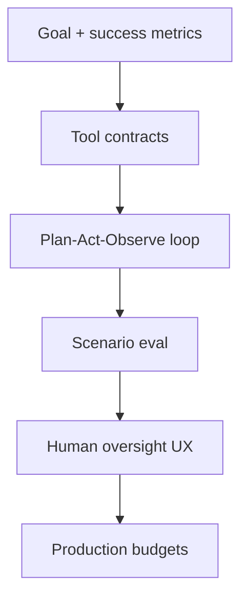

# Designing Agentic Systems

> Goals, tools, memory, evaluation, and oversight in one design loop.

## Definition

Design agentic systems by specifying goals, success criteria, tool contracts, memory, stop conditions, and oversight. Implement the simplest control loop that hits reliability targets.

## Why it matters

Framework choice is secondary to tool safety and eval. A thin loop with great tools beats a fancy planner with sloppy permissions.

## How it works

## Key principles

1. **Tools are the product** — Narrow, typed, authz-aware.
2. **Eval agent trajectories** — Not just final answers.
3. **Degrade gracefully** — Fall back to chatbot/RAG modes.

## Common applications

| Application | Description |
|-------------|-------------|
| IT agents | Runbooks as tools |
| Sales ops | CRM-constrained actions |
| Dev agents | Repo + CI tools |

## Common mistakes

- Untyped shell tools as the first integration
- No trajectory logging

## Further reading

- [AI Agents](../ai-agents/README.md)
- [MCP](../mcp/README.md)
- [Multi-Agent Systems](../multi-agent-systems/README.md)
