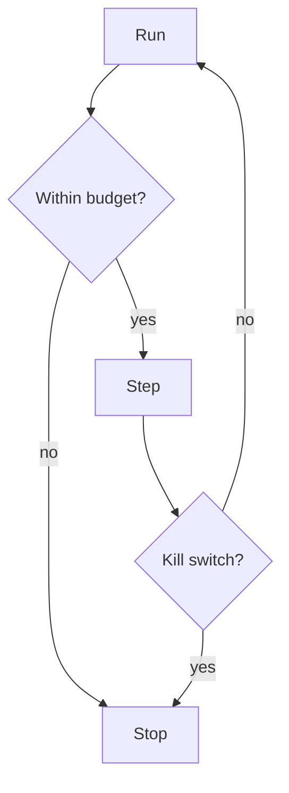

# Budgets and Kill Switches

> Hard limits on steps, tokens, dollars, wall-clock, and blast radius — plus emergency stops that halt agent execution immediately.

## Table of Contents

- [Overview](#overview)
- [Definition](#definition)
- [Why It Matters](#why-it-matters)
- [Uses](#uses)
- [How It Works](#how-it-works)
- [Worked Example](#worked-example)
- [Python Examples](#python-examples)
- [Production Considerations](#production-considerations)
- [Performance Considerations](#performance-considerations)
- [Cost Considerations](#cost-considerations)
- [Security Considerations](#security-considerations)
- [Best Practices](#best-practices)
- [Common Mistakes](#common-mistakes)
- [Interview Preparation](#interview-preparation)
- [Navigation](#navigation)

---

## Overview

This lesson covers **Budgets and Kill Switches** inside the `governance` section of the `agentic-ai` handbook. Treat it as production engineering guidance: clear definitions, when to apply the idea, system shape, and code you can adapt.

---

## Definition

**Budgets and Kill Switches** — Hard limits on steps, tokens, dollars, wall-clock, and blast radius — plus emergency stops that halt agent execution immediately.

---

## Why It Matters

Unbounded loops are the fastest way to burn money and trust. Budgets make agency safe enough to enable; kill switches make incidents survivable.

Without a clear model for this topic, teams ship demos that fail under load, cost, or correctness pressure.

---

## Uses

| Use case | How this applies |
|----------|------------------|
| Per-run | max steps / max USD / max minutes |
| Per-tenant | daily agent spend caps |
| Per-tool | rate limits and concurrency |
| Global | kill switch disables autonomy org-wide |

---

## How It Works

Enforce budgets in the orchestrator, not the prompt. Emit metrics when approaching limits. Kill switches must be reachable by on-call without redeploying prompts.



---

## Worked Example

Tenant hits $50/day agent cap at 14:00; new runs route to chatbot mode until reset. On-call flips global kill during provider outage.

---

## Python Examples

```python
from dataclasses import dataclass
from time import time

@dataclass
class RunBudget:
    max_steps: int = 20
    max_usd: float = 5.0
    max_seconds: float = 300.0

@dataclass
class RunMeter:
    steps: int = 0
    usd: float = 0.0
    started: float = 0.0

    def start(self) -> None:
        self.started = time()

def budget_ok(meter: RunMeter, budget: RunBudget) -> bool:
    if meter.steps >= budget.max_steps:
        return False
    if meter.usd >= budget.max_usd:
        return False
    if meter.started and (time() - meter.started) >= budget.max_seconds:
        return False
    return True

class KillSwitch:
    def __init__(self):
        self._tripped = False
        self.reason = ""

    def trip(self, reason: str) -> None:
        self._tripped = True
        self.reason = reason

    def clear(self) -> None:
        self._tripped = False
        self.reason = ""

    @property
    def active(self) -> bool:
        return self._tripped

def allow_agent_step(meter: RunMeter, budget: RunBudget, kill: KillSwitch) -> tuple[bool, str]:
    if kill.active:
        return False, f"kill_switch:{kill.reason}"
    if not budget_ok(meter, budget):
        return False, "budget_exceeded"
    return True, "ok"

```

---

## Production Considerations

- Log request IDs across orchestration steps.
- Fail closed on auth and policy; degrade only where product explicitly allows it.
- Keep feature flags for prompt/model swaps.

## Performance Considerations

- Bound concurrency to the model provider.
- Stream when UX needs time-to-first-token.
- Cache stable sub-results carefully with invalidation rules.

## Cost Considerations

- Track tokens and tool calls per feature / tenant.
- Prefer smaller models for routers and classifiers.
- Cap max tokens and tool-loop iterations.

## Security Considerations

- Never put secrets in prompts.
- Treat model output as untrusted until validated.
- Enforce tenant isolation on retrieval and tools.

---

## Best Practices

1. Prefer explicit interfaces over prompt-only business logic.
2. Measure latency, cost, and quality together on every agent run.
3. Keep prompts, tool schemas, and configs versioned as one artifact.
4. Bound tool loops with max steps, wall-clock, and dollar budgets.
5. Log structured trajectories so failures are debuggable offline.

---

## Common Mistakes

- Shipping without golden trajectory evals.
- Hiding critical state only inside the model context window.
- No timeouts or budget limits on model or tool calls.
- Granting write tools before read-only autonomy is proven.
- Treating a chatbot with one tool as a production agentic system.

---

## Interview Preparation

**Q: How is agentic AI different from a chatbot?**

A: Chatbots optimize turn quality; agentic systems optimize goal completion via planning, tools, memory, and oversight under budgets.

**Q: What belongs in code vs the planner prompt?**

A: Auth, billing, validation, allow-lists, and kill-switches stay in code; stylistic planning heuristics can live in prompts.

**Q: How do you roll out higher autonomy safely?**

A: Start read-only, shadow write actions, gate on trajectory evals, canary a tenant slice, keep one-click rollback to lower autonomy.

---

## Navigation

- **Section hub:** [README](README.md)
- **Topic hub:** [../README.md](../README.md)
