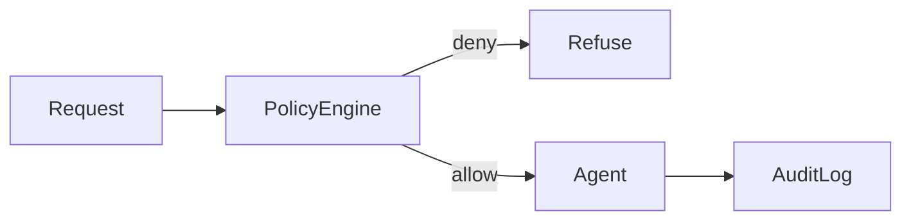

# Audit and Policy

> Recording who/what/why for every agent decision and enforcing policy engines that constrain tools, data access, and outputs.

## Table of Contents

- [Overview](#overview)
- [Definition](#definition)
- [Why It Matters](#why-it-matters)
- [Uses](#uses)
- [How It Works](#how-it-works)
- [Worked Example](#worked-example)
- [Python Examples](#python-examples)
- [Production Considerations](#production-considerations)
- [Performance Considerations](#performance-considerations)
- [Cost Considerations](#cost-considerations)
- [Security Considerations](#security-considerations)
- [Best Practices](#best-practices)
- [Common Mistakes](#common-mistakes)
- [Interview Preparation](#interview-preparation)
- [Navigation](#navigation)

---

## Overview

This lesson covers **Audit and Policy** inside the `governance` section of the `agentic-ai` handbook. Treat it as production engineering guidance: clear definitions, when to apply the idea, system shape, and code you can adapt.

---

## Definition

**Audit and Policy** — Recording who/what/why for every agent decision and enforcing policy engines that constrain tools, data access, and outputs.

---

## Why It Matters

Regulated and enterprise buyers ask how an agent decided. Audit trails and policy-as-code answer them without relying on chat transcripts alone.

Without a clear model for this topic, teams ship demos that fail under load, cost, or correctness pressure.

---

## Uses

| Use case | How this applies |
|----------|------------------|
| Access policy | Which tools/data per role |
| Output policy | PII, secrets, prohibited advice |
| Change policy | What writes need dual control |
| Audit export | Immutable trajectory packages |

---

## How It Works

Evaluate policy before tool execution. Store allow/deny decisions with rule ids. Hash trajectories for tamper evidence when required.



---

## Worked Example

Agent tries `export_customers`; policy denies for role=support. Decision logged with rule `pii.export.forbid`.

---

## Python Examples

```python
from dataclasses import dataclass, field
from typing import Any
import hashlib
import json
import time

@dataclass
class PolicyDecision:
    allow: bool
    rule_id: str
    detail: str

@dataclass
class AuditEvent:
    ts: float
    run_id: str
    actor: str
    action: str
    args: dict
    decision: dict
    observation: Any = None

class PolicyEngine:
    def __init__(self, denied_tools: set[str] | None = None):
        self.denied_tools = denied_tools or set()

    def check(self, role: str, tool: str, args: dict) -> PolicyDecision:
        if tool in self.denied_tools:
            return PolicyDecision(False, "tool.deny_list", tool)
        if tool.startswith("export_") and role != "admin":
            return PolicyDecision(False, "pii.export.forbid", role)
        if "ssn" in json.dumps(args).lower():
            return PolicyDecision(False, "pii.args.forbid", "ssn")
        return PolicyDecision(True, "default.allow", "ok")

class AuditLog:
    def __init__(self):
        self.events: list[AuditEvent] = field(default_factory=list) if False else []

    def record(self, ev: AuditEvent) -> None:
        self.events.append(ev)

    def trajectory_hash(self, run_id: str) -> str:
        payload = [e.__dict__ for e in self.events if e.run_id == run_id]
        blob = json.dumps(payload, sort_keys=True, default=str)
        return hashlib.sha256(blob.encode()).hexdigest()

def gated_tool(engine: PolicyEngine, audit: AuditLog, run_id: str, role: str, tool: str, args: dict, fn):
    decision = engine.check(role, tool, args)
    if not decision.allow:
        audit.record(AuditEvent(time.time(), run_id, role, tool, args, decision.__dict__))
        raise PermissionError(decision.rule_id)
    result = fn(args)
    audit.record(AuditEvent(time.time(), run_id, role, tool, args, decision.__dict__, result))
    return result

```

---

## Production Considerations

- Log request IDs across orchestration steps.
- Fail closed on auth and policy; degrade only where product explicitly allows it.
- Keep feature flags for prompt/model swaps.

## Performance Considerations

- Bound concurrency to the model provider.
- Stream when UX needs time-to-first-token.
- Cache stable sub-results carefully with invalidation rules.

## Cost Considerations

- Track tokens and tool calls per feature / tenant.
- Prefer smaller models for routers and classifiers.
- Cap max tokens and tool-loop iterations.

## Security Considerations

- Never put secrets in prompts.
- Treat model output as untrusted until validated.
- Enforce tenant isolation on retrieval and tools.

---

## Best Practices

1. Prefer explicit interfaces over prompt-only business logic.
2. Measure latency, cost, and quality together on every agent run.
3. Keep prompts, tool schemas, and configs versioned as one artifact.
4. Bound tool loops with max steps, wall-clock, and dollar budgets.
5. Log structured trajectories so failures are debuggable offline.

---

## Common Mistakes

- Shipping without golden trajectory evals.
- Hiding critical state only inside the model context window.
- No timeouts or budget limits on model or tool calls.
- Granting write tools before read-only autonomy is proven.
- Treating a chatbot with one tool as a production agentic system.

---

## Interview Preparation

**Q: How is agentic AI different from a chatbot?**

A: Chatbots optimize turn quality; agentic systems optimize goal completion via planning, tools, memory, and oversight under budgets.

**Q: What belongs in code vs the planner prompt?**

A: Auth, billing, validation, allow-lists, and kill-switches stay in code; stylistic planning heuristics can live in prompts.

**Q: How do you roll out higher autonomy safely?**

A: Start read-only, shadow write actions, gate on trajectory evals, canary a tenant slice, keep one-click rollback to lower autonomy.

---

## Navigation

- **Section hub:** [README](README.md)
- **Topic hub:** [../README.md](../README.md)
