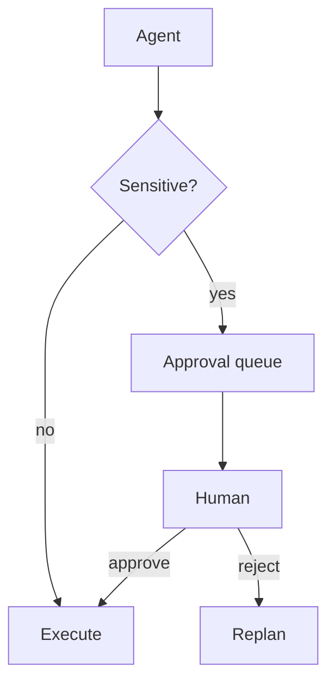

# Human Oversight

> Design patterns for human-in-the-loop, human-on-the-loop, and exception-based review so agency stays accountable without killing speed.

## Table of Contents

- [Overview](#overview)
- [Definition](#definition)
- [Why It Matters](#why-it-matters)
- [Uses](#uses)
- [How It Works](#how-it-works)
- [Worked Example](#worked-example)
- [Python Examples](#python-examples)
- [Production Considerations](#production-considerations)
- [Performance Considerations](#performance-considerations)
- [Cost Considerations](#cost-considerations)
- [Security Considerations](#security-considerations)
- [Best Practices](#best-practices)
- [Common Mistakes](#common-mistakes)
- [Interview Preparation](#interview-preparation)
- [Navigation](#navigation)

---

## Overview

This lesson covers **Human Oversight** inside the `governance` section of the `agentic-ai` handbook. Treat it as production engineering guidance: clear definitions, when to apply the idea, system shape, and code you can adapt.

---

## Definition

**Human Oversight** — Design patterns for human-in-the-loop, human-on-the-loop, and exception-based review so agency stays accountable without killing speed.

---

## Why It Matters

Oversight is a UX and workflow problem: approval queues, SLAs, and clear diffs of what the agent intends to do. Without it, autonomy either stalls or goes rogue.

Without a clear model for this topic, teams ship demos that fail under load, cost, or correctness pressure.

---

## Uses

| Use case | How this applies |
|----------|------------------|
| HITL | Approve each sensitive action |
| HOTL | Monitor streams; intervene on anomaly |
| Exception review | Auto-run; humans review failures/low confidence |
| Dual control | Two humans for high blast-radius acts |

---

## How It Works

Show proposed tool args as a diff humans can understand. Expire approvals. Never silently escalate autonomy when the queue times out — fail closed or safe-default.



---

## Worked Example

Refund > $200 enters approval queue with order summary and policy cite; manager approves in Slack action; agent continues.

---

## Python Examples

```python
from dataclasses import dataclass, field
from time import time
from typing import Any

@dataclass
class ApprovalRequest:
    id: str
    run_id: str
    action: str
    args: dict
    reason: str
    created: float = field(default_factory=time)
    status: str = "pending"  # pending|approved|rejected|expired
    ttl_sec: float = 3600

@dataclass
class OversightQueue:
    pending: dict[str, ApprovalRequest] = field(default_factory=dict)

    def submit(self, req: ApprovalRequest) -> str:
        self.pending[req.id] = req
        return req.id

    def resolve(self, req_id: str, approve: bool) -> ApprovalRequest:
        req = self.pending[req_id]
        req.status = "approved" if approve else "rejected"
        return req

    def expire_old(self, now: float | None = None) -> list[str]:
        now = now or time()
        expired = []
        for rid, req in list(self.pending.items()):
            if req.status == "pending" and now - req.created > req.ttl_sec:
                req.status = "expired"
                expired.append(rid)
        return expired

def needs_human(action: str, args: dict, thresholds: dict) -> bool:
    if action in thresholds.get("always_approve", set()):
        return True
    amount = float(args.get("amount", 0))
    return amount >= float(thresholds.get("amount", 1e9))

def wait_for_decision(queue: OversightQueue, req_id: str) -> str:
    queue.expire_old()
    return queue.pending[req_id].status

```

---

## Production Considerations

- Log request IDs across orchestration steps.
- Fail closed on auth and policy; degrade only where product explicitly allows it.
- Keep feature flags for prompt/model swaps.

## Performance Considerations

- Bound concurrency to the model provider.
- Stream when UX needs time-to-first-token.
- Cache stable sub-results carefully with invalidation rules.

## Cost Considerations

- Track tokens and tool calls per feature / tenant.
- Prefer smaller models for routers and classifiers.
- Cap max tokens and tool-loop iterations.

## Security Considerations

- Never put secrets in prompts.
- Treat model output as untrusted until validated.
- Enforce tenant isolation on retrieval and tools.

---

## Best Practices

1. Prefer explicit interfaces over prompt-only business logic.
2. Measure latency, cost, and quality together on every agent run.
3. Keep prompts, tool schemas, and configs versioned as one artifact.
4. Bound tool loops with max steps, wall-clock, and dollar budgets.
5. Log structured trajectories so failures are debuggable offline.

---

## Common Mistakes

- Shipping without golden trajectory evals.
- Hiding critical state only inside the model context window.
- No timeouts or budget limits on model or tool calls.
- Granting write tools before read-only autonomy is proven.
- Treating a chatbot with one tool as a production agentic system.

---

## Interview Preparation

**Q: How is agentic AI different from a chatbot?**

A: Chatbots optimize turn quality; agentic systems optimize goal completion via planning, tools, memory, and oversight under budgets.

**Q: What belongs in code vs the planner prompt?**

A: Auth, billing, validation, allow-lists, and kill-switches stay in code; stylistic planning heuristics can live in prompts.

**Q: How do you roll out higher autonomy safely?**

A: Start read-only, shadow write actions, gate on trajectory evals, canary a tenant slice, keep one-click rollback to lower autonomy.

---

## Navigation

- **Section hub:** [README](README.md)
- **Topic hub:** [../README.md](../README.md)
