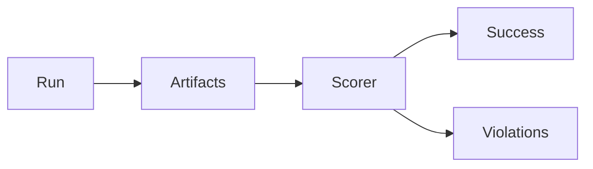

# Task Success Metrics

> Defining and measuring whether an agent achieved the user's goal — binary success, graded rubrics, and constraint violations — independent of fluent narration.

## Table of Contents

- [Overview](#overview)
- [Definition](#definition)
- [Why It Matters](#why-it-matters)
- [Uses](#uses)
- [How It Works](#how-it-works)
- [Worked Example](#worked-example)
- [Python Examples](#python-examples)
- [Production Considerations](#production-considerations)
- [Performance Considerations](#performance-considerations)
- [Cost Considerations](#cost-considerations)
- [Security Considerations](#security-considerations)
- [Best Practices](#best-practices)
- [Common Mistakes](#common-mistakes)
- [Interview Preparation](#interview-preparation)
- [Navigation](#navigation)

---

## Overview

This lesson covers **Task Success Metrics** inside the `measurement` section of the `agentic-ai` handbook. Treat it as production engineering guidance: clear definitions, when to apply the idea, system shape, and code you can adapt.

---

## Definition

**Task Success Metrics** — Defining and measuring whether an agent achieved the user's goal — binary success, graded rubrics, and constraint violations — independent of fluent narration.

---

## Why It Matters

Fluency is not success. Task metrics tie agent investment to business outcomes and catch agents that 'sound done' while leaving work incomplete.

Without a clear model for this topic, teams ship demos that fail under load, cost, or correctness pressure.

---

## Uses

| Use case | How this applies |
|----------|------------------|
| Binary | Goal met / not met |
| Graded | Partial credit rubrics |
| Constraints | Policy/safety violations |
| Business | Ticket resolved, PO created, PR merged |

---

## How It Works

Prefer checking world state and external systems over judging the final message. Combine automatic checks with spot human labels.



---

## Worked Example

Goal 'reset password and confirm email sent': success if auth API shows reset + email provider accepted message, regardless of chat wording.

---

## Python Examples

```python
from dataclasses import dataclass

@dataclass
class TaskScore:
    success: bool
    score: float
    violations: list[str]
    evidence: dict

def score_password_reset(world: dict, email_log: list[dict]) -> TaskScore:
    violations = []
    ok_auth = world.get("password_reset_issued") is True
    ok_email = any(e.get("template") == "password_reset" and e.get("status") == "accepted" for e in email_log)
    if world.get("emailed_plaintext_password"):
        violations.append("security.plaintext_password")
    success = ok_auth and ok_email and not violations
    partial = 0.5 * float(ok_auth) + 0.5 * float(ok_email)
    return TaskScore(success, partial if not success else 1.0, violations, {
        "auth": ok_auth, "email": ok_email,
    })

def aggregate(scores: list[TaskScore]) -> dict:
    n = max(1, len(scores))
    return {
        "success_rate": sum(s.success for s in scores) / n,
        "avg_score": sum(s.score for s in scores) / n,
        "violation_rate": sum(1 for s in scores if s.violations) / n,
    }

```

---

## Production Considerations

- Log request IDs across orchestration steps.
- Fail closed on auth and policy; degrade only where product explicitly allows it.
- Keep feature flags for prompt/model swaps.

## Performance Considerations

- Bound concurrency to the model provider.
- Stream when UX needs time-to-first-token.
- Cache stable sub-results carefully with invalidation rules.

## Cost Considerations

- Track tokens and tool calls per feature / tenant.
- Prefer smaller models for routers and classifiers.
- Cap max tokens and tool-loop iterations.

## Security Considerations

- Never put secrets in prompts.
- Treat model output as untrusted until validated.
- Enforce tenant isolation on retrieval and tools.

---

## Best Practices

1. Prefer explicit interfaces over prompt-only business logic.
2. Measure latency, cost, and quality together on every agent run.
3. Keep prompts, tool schemas, and configs versioned as one artifact.
4. Bound tool loops with max steps, wall-clock, and dollar budgets.
5. Log structured trajectories so failures are debuggable offline.

---

## Common Mistakes

- Shipping without golden trajectory evals.
- Hiding critical state only inside the model context window.
- No timeouts or budget limits on model or tool calls.
- Granting write tools before read-only autonomy is proven.
- Treating a chatbot with one tool as a production agentic system.

---

## Interview Preparation

**Q: How is agentic AI different from a chatbot?**

A: Chatbots optimize turn quality; agentic systems optimize goal completion via planning, tools, memory, and oversight under budgets.

**Q: What belongs in code vs the planner prompt?**

A: Auth, billing, validation, allow-lists, and kill-switches stay in code; stylistic planning heuristics can live in prompts.

**Q: How do you roll out higher autonomy safely?**

A: Start read-only, shadow write actions, gate on trajectory evals, canary a tenant slice, keep one-click rollback to lower autonomy.

---

## Navigation

- **Section hub:** [README](README.md)
- **Topic hub:** [../README.md](../README.md)
