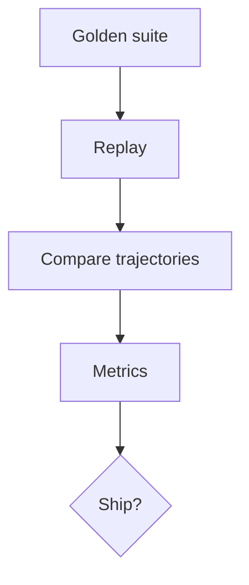

# Trajectory Evaluation

> Evaluating the path an agent took — tool choices, plan revisions, and intermediate errors — not only the final answer.

## Table of Contents

- [Overview](#overview)
- [Definition](#definition)
- [Why It Matters](#why-it-matters)
- [Uses](#uses)
- [How It Works](#how-it-works)
- [Worked Example](#worked-example)
- [Python Examples](#python-examples)
- [Production Considerations](#production-considerations)
- [Performance Considerations](#performance-considerations)
- [Cost Considerations](#cost-considerations)
- [Security Considerations](#security-considerations)
- [Best Practices](#best-practices)
- [Common Mistakes](#common-mistakes)
- [Interview Preparation](#interview-preparation)
- [Navigation](#navigation)

---

## Overview

This lesson covers **Trajectory Evaluation** inside the `measurement` section of the `agentic-ai` handbook. Treat it as production engineering guidance: clear definitions, when to apply the idea, system shape, and code you can adapt.

---

## Definition

**Trajectory Evaluation** — Evaluating the path an agent took — tool choices, plan revisions, and intermediate errors — not only the final answer.

---

## Why It Matters

Two agents can both succeed while one wastes 30 tools and violates policy mid-run. Trajectory evals catch inefficient, unsafe, or brittle strategies before they scale.

Without a clear model for this topic, teams ship demos that fail under load, cost, or correctness pressure.

---

## Uses

| Use case | How this applies |
|----------|------------------|
| Golden paths | Expected tool sequences |
| Rubrics | Judge plan quality and recovery |
| Policy mid-run | No forbidden tools even if final OK |
| Regression | Compare new planner to baseline trajectories |

---

## How It Works

Build a frozen suite of goals with acceptable trajectory patterns. Score process metrics: steps, redundant calls, recoveries, policy breaks. Use LLM-as-judge carefully with anchored rubrics.



---

## Worked Example

New planner reaches same success rate but average steps 18→9 and zero policy breaks — ship. Another variant succeeds with a forbidden export tool mid-run — block.

---

## Python Examples

```python
from dataclasses import dataclass

@dataclass
class Trajectory:
    goal_id: str
    tools: list[str]
    success: bool
    policy_breaks: list[str]

@dataclass
class TrajectoryMetrics:
    success: bool
    steps: int
    redundant: int
    policy_breaks: int
    score: float

def redundant_calls(tools: list[str]) -> int:
    seen = set()
    red = 0
    for t in tools:
        key = t.split("?")[0]
        if key in seen:
            red += 1
        seen.add(key)
    return red

def eval_trajectory(tr: Trajectory, max_steps: int = 15) -> TrajectoryMetrics:
    red = redundant_calls(tr.tools)
    breaks = len(tr.policy_breaks)
    steps = len(tr.tools)
    score = 0.0
    if tr.success:
        score += 0.6
    score += 0.2 * max(0, 1 - steps / max_steps)
    score += 0.1 * max(0, 1 - red / 5)
    score -= 0.3 * breaks
    return TrajectoryMetrics(tr.success, steps, red, breaks, max(0.0, score))

def gate(results: list[TrajectoryMetrics], min_avg: float = 0.75, max_break_rate: float = 0.0) -> bool:
    n = max(1, len(results))
    avg = sum(r.score for r in results) / n
    br = sum(1 for r in results if r.policy_breaks) / n
    return avg >= min_avg and br <= max_break_rate

```

---

## Production Considerations

- Log request IDs across orchestration steps.
- Fail closed on auth and policy; degrade only where product explicitly allows it.
- Keep feature flags for prompt/model swaps.

## Performance Considerations

- Bound concurrency to the model provider.
- Stream when UX needs time-to-first-token.
- Cache stable sub-results carefully with invalidation rules.

## Cost Considerations

- Track tokens and tool calls per feature / tenant.
- Prefer smaller models for routers and classifiers.
- Cap max tokens and tool-loop iterations.

## Security Considerations

- Never put secrets in prompts.
- Treat model output as untrusted until validated.
- Enforce tenant isolation on retrieval and tools.

---

## Best Practices

1. Prefer explicit interfaces over prompt-only business logic.
2. Measure latency, cost, and quality together on every agent run.
3. Keep prompts, tool schemas, and configs versioned as one artifact.
4. Bound tool loops with max steps, wall-clock, and dollar budgets.
5. Log structured trajectories so failures are debuggable offline.

---

## Common Mistakes

- Shipping without golden trajectory evals.
- Hiding critical state only inside the model context window.
- No timeouts or budget limits on model or tool calls.
- Granting write tools before read-only autonomy is proven.
- Treating a chatbot with one tool as a production agentic system.

---

## Interview Preparation

**Q: How is agentic AI different from a chatbot?**

A: Chatbots optimize turn quality; agentic systems optimize goal completion via planning, tools, memory, and oversight under budgets.

**Q: What belongs in code vs the planner prompt?**

A: Auth, billing, validation, allow-lists, and kill-switches stay in code; stylistic planning heuristics can live in prompts.

**Q: How do you roll out higher autonomy safely?**

A: Start read-only, shadow write actions, gate on trajectory evals, canary a tenant slice, keep one-click rollback to lower autonomy.

---

## Navigation

- **Section hub:** [README](README.md)
- **Topic hub:** [../README.md](../README.md)
