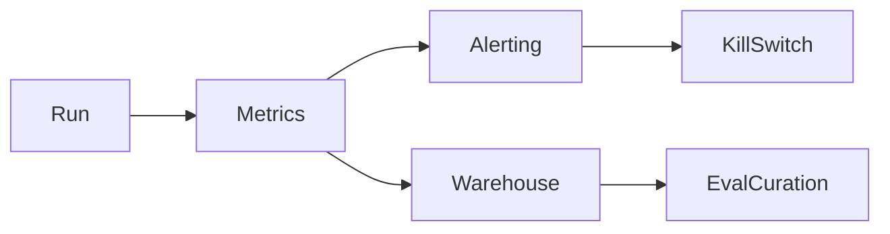

# Online Monitoring for Agents

> Live telemetry for agent runs: success proxies, cost, latency, loop detectors, tool error rates, and user escalation — wired to alerts and kill switches.

## Table of Contents

- [Overview](#overview)
- [Definition](#definition)
- [Why It Matters](#why-it-matters)
- [Uses](#uses)
- [How It Works](#how-it-works)
- [Worked Example](#worked-example)
- [Python Examples](#python-examples)
- [Production Considerations](#production-considerations)
- [Performance Considerations](#performance-considerations)
- [Cost Considerations](#cost-considerations)
- [Security Considerations](#security-considerations)
- [Best Practices](#best-practices)
- [Common Mistakes](#common-mistakes)
- [Interview Preparation](#interview-preparation)
- [Navigation](#navigation)

---

## Overview

This lesson covers **Online Monitoring for Agents** inside the `measurement` section of the `agentic-ai` handbook. Treat it as production engineering guidance: clear definitions, when to apply the idea, system shape, and code you can adapt.

---

## Definition

**Online Monitoring for Agents** — Live telemetry for agent runs: success proxies, cost, latency, loop detectors, tool error rates, and user escalation — wired to alerts and kill switches.

---

## Why It Matters

Offline evals drift from reality. Online monitoring catches novel failures, cost spikes, and stuck loops in production while feeding curation for the next eval suite.

Without a clear model for this topic, teams ship demos that fail under load, cost, or correctness pressure.

---

## Uses

| Use case | How this applies |
|----------|------------------|
| SLIs | task success proxy, steps/run, $/run |
| Safety | policy deny rate, jailbreak hits |
| Reliability | tool 5xx, timeout rate, kill trips |
| UX | escalation rate, thumbs-down |

---

## How It Works

Emit one event per step and one summary per run. Alert on burn rate and loop signatures (repeated identical tool args). Sample traces for weekly human review.



---

## Worked Example

Spike in repeated `search_docs` with same query → loop alert → auto-stop runs exceeding pattern → ticket to planner owners.

---

## Python Examples

```python
from dataclasses import dataclass, field
from collections import Counter
from time import time

@dataclass
class StepEvent:
    run_id: str
    tool: str
    args_fingerprint: str
    latency_ms: float
    ok: bool
    usd: float

@dataclass
class RunSummary:
    run_id: str
    success_proxy: bool
    steps: int
    usd: float
    escalated: bool

@dataclass
class Monitor:
    steps: list[StepEvent] = field(default_factory=list)
    summaries: list[RunSummary] = field(default_factory=list)

    def on_step(self, ev: StepEvent) -> list[str]:
        self.steps.append(ev)
        alerts = []
        recent = [s for s in self.steps if s.run_id == ev.run_id][-6:]
        fps = [s.args_fingerprint for s in recent if s.tool == ev.tool]
        if len(fps) >= 4 and len(set(fps)) == 1:
            alerts.append("loop_detected")
        if ev.usd > 1.0:
            alerts.append("expensive_step")
        return alerts

    def sli(self, since: float) -> dict:
        runs = [r for r in self.summaries if True]
        n = max(1, len(runs))
        return {
            "success_rate": sum(r.success_proxy for r in runs) / n,
            "avg_steps": sum(r.steps for r in runs) / n,
            "avg_usd": sum(r.usd for r in runs) / n,
            "escalate_rate": sum(r.escalated for r in runs) / n,
            "ts": time(),
        }

def tool_error_rate(steps: list[StepEvent]) -> dict[str, float]:
    c = Counter(s.tool for s in steps)
    bad = Counter(s.tool for s in steps if not s.ok)
    return {t: bad[t] / c[t] for t in c}

```

---

## Production Considerations

- Log request IDs across orchestration steps.
- Fail closed on auth and policy; degrade only where product explicitly allows it.
- Keep feature flags for prompt/model swaps.

## Performance Considerations

- Bound concurrency to the model provider.
- Stream when UX needs time-to-first-token.
- Cache stable sub-results carefully with invalidation rules.

## Cost Considerations

- Track tokens and tool calls per feature / tenant.
- Prefer smaller models for routers and classifiers.
- Cap max tokens and tool-loop iterations.

## Security Considerations

- Never put secrets in prompts.
- Treat model output as untrusted until validated.
- Enforce tenant isolation on retrieval and tools.

---

## Best Practices

1. Prefer explicit interfaces over prompt-only business logic.
2. Measure latency, cost, and quality together on every agent run.
3. Keep prompts, tool schemas, and configs versioned as one artifact.
4. Bound tool loops with max steps, wall-clock, and dollar budgets.
5. Log structured trajectories so failures are debuggable offline.

---

## Common Mistakes

- Shipping without golden trajectory evals.
- Hiding critical state only inside the model context window.
- No timeouts or budget limits on model or tool calls.
- Granting write tools before read-only autonomy is proven.
- Treating a chatbot with one tool as a production agentic system.

---

## Interview Preparation

**Q: How is agentic AI different from a chatbot?**

A: Chatbots optimize turn quality; agentic systems optimize goal completion via planning, tools, memory, and oversight under budgets.

**Q: What belongs in code vs the planner prompt?**

A: Auth, billing, validation, allow-lists, and kill-switches stay in code; stylistic planning heuristics can live in prompts.

**Q: How do you roll out higher autonomy safely?**

A: Start read-only, shadow write actions, gate on trajectory evals, canary a tenant slice, keep one-click rollback to lower autonomy.

---

## Navigation

- **Section hub:** [README](README.md)
- **Topic hub:** [../README.md](../README.md)
