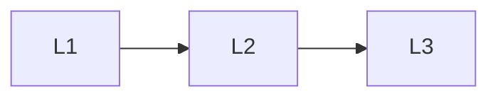

# Measurement

> Section of the **agentic-ai** handbook.

## Lessons

| # | Lesson |
|---|--------|
| 1 | [Task Success Metrics](01-task-success.md) |
| 2 | [Trajectory Evaluation](02-trajectory-eval.md) |
| 3 | [Online Monitoring for Agents](03-online-monitoring.md) |

**Topic hub:** [../README.md](../README.md)
