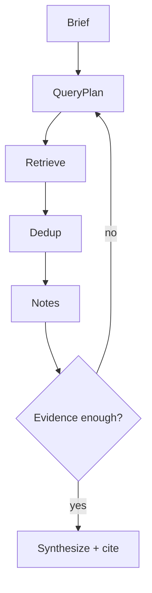

# Research Agents

> Agentic systems that gather, filter, and synthesize information across sources toward a research brief — with citation discipline and stop criteria.

## Table of Contents

- [Overview](#overview)
- [Definition](#definition)
- [Why It Matters](#why-it-matters)
- [Uses](#uses)
- [How It Works](#how-it-works)
- [Worked Example](#worked-example)
- [Python Examples](#python-examples)
- [Production Considerations](#production-considerations)
- [Performance Considerations](#performance-considerations)
- [Cost Considerations](#cost-considerations)
- [Security Considerations](#security-considerations)
- [Best Practices](#best-practices)
- [Common Mistakes](#common-mistakes)
- [Interview Preparation](#interview-preparation)
- [Navigation](#navigation)

---

## Overview

This lesson covers **Research Agents** inside the `product-patterns` section of the `agentic-ai` handbook. Treat it as production engineering guidance: clear definitions, when to apply the idea, system shape, and code you can adapt.

---

## Definition

**Research Agents** — Agentic systems that gather, filter, and synthesize information across sources toward a research brief — with citation discipline and stop criteria.

---

## Why It Matters

Research is a common agentic win because tools are mostly read-only, yet quality fails without source tracking, duplication control, and clear 'enough evidence' gates.

Without a clear model for this topic, teams ship demos that fail under load, cost, or correctness pressure.

---

## Uses

| Use case | How this applies |
|----------|------------------|
| Competitive intel | Periodic landscape briefs |
| Due diligence | Company or vendor packs |
| Customer research | Synthesize tickets + reviews |
| Scientific lit | Paper triage with citations |

---

## How It Works

Require every claim to map to a source id in world state. Cap browse depth. Prefer structured notes over dumping raw HTML into context.



---

## Worked Example

Brief: 'Summarize SOC2 controls for vendor X.' Agent searches trust center, stores control list with URLs, stops when coverage checklist complete, writes cited memo.

---

## Python Examples

```python
from dataclasses import dataclass, field

@dataclass
class Source:
    id: str
    url: str
    title: str
    snippet: str

@dataclass
class Claim:
    text: str
    source_ids: list[str]

@dataclass
class ResearchState:
    brief: str
    sources: dict[str, Source] = field(default_factory=dict)
    claims: list[Claim] = field(default_factory=list)
    open_questions: list[str] = field(default_factory=list)

    def add_source(self, s: Source) -> None:
        self.sources[s.id] = s

    def add_claim(self, text: str, source_ids: list[str]) -> None:
        missing = [i for i in source_ids if i not in self.sources]
        if missing:
            raise ValueError(f"unknown sources: {missing}")
        self.claims.append(Claim(text, source_ids))

def evidence_enough(state: ResearchState, min_sources: int = 3, max_questions: int = 0) -> bool:
    return len(state.sources) >= min_sources and len(state.open_questions) <= max_questions

def render_brief(state: ResearchState) -> str:
    lines = [f"# Research: {state.brief}", "", "## Claims"]
    for c in state.claims:
        cites = ", ".join(c.source_ids)
        lines.append(f"- {c.text} [{cites}]")
    lines.append("", "## Sources")
    for s in state.sources.values():
        lines.append(f"- {s.id}: {s.title} — {s.url}")
    return "\n".join(lines)

```

---

## Production Considerations

- Log request IDs across orchestration steps.
- Fail closed on auth and policy; degrade only where product explicitly allows it.
- Keep feature flags for prompt/model swaps.

## Performance Considerations

- Bound concurrency to the model provider.
- Stream when UX needs time-to-first-token.
- Cache stable sub-results carefully with invalidation rules.

## Cost Considerations

- Track tokens and tool calls per feature / tenant.
- Prefer smaller models for routers and classifiers.
- Cap max tokens and tool-loop iterations.

## Security Considerations

- Never put secrets in prompts.
- Treat model output as untrusted until validated.
- Enforce tenant isolation on retrieval and tools.

---

## Best Practices

1. Prefer explicit interfaces over prompt-only business logic.
2. Measure latency, cost, and quality together on every agent run.
3. Keep prompts, tool schemas, and configs versioned as one artifact.
4. Bound tool loops with max steps, wall-clock, and dollar budgets.
5. Log structured trajectories so failures are debuggable offline.

---

## Common Mistakes

- Shipping without golden trajectory evals.
- Hiding critical state only inside the model context window.
- No timeouts or budget limits on model or tool calls.
- Granting write tools before read-only autonomy is proven.
- Treating a chatbot with one tool as a production agentic system.

---

## Interview Preparation

**Q: How is agentic AI different from a chatbot?**

A: Chatbots optimize turn quality; agentic systems optimize goal completion via planning, tools, memory, and oversight under budgets.

**Q: What belongs in code vs the planner prompt?**

A: Auth, billing, validation, allow-lists, and kill-switches stay in code; stylistic planning heuristics can live in prompts.

**Q: How do you roll out higher autonomy safely?**

A: Start read-only, shadow write actions, gate on trajectory evals, canary a tenant slice, keep one-click rollback to lower autonomy.

---

## Navigation

- **Section hub:** [README](README.md)
- **Topic hub:** [../README.md](../README.md)
