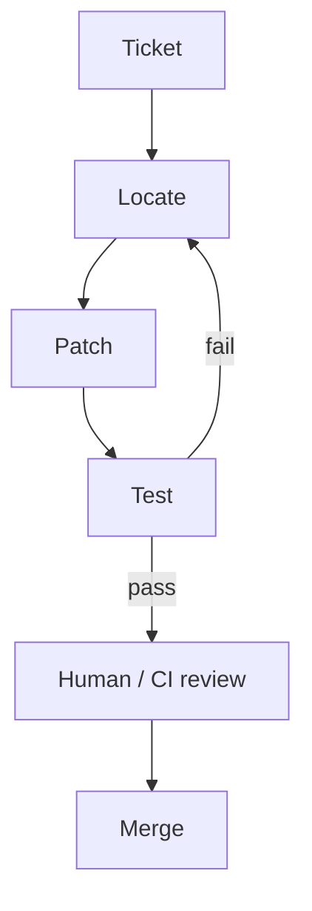

# Coding Agents

> Agents that edit codebases via tools (read, patch, test, lint) in a closed loop toward a development goal with sandboxing and review gates.

## Table of Contents

- [Overview](#overview)
- [Definition](#definition)
- [Why It Matters](#why-it-matters)
- [Uses](#uses)
- [How It Works](#how-it-works)
- [Worked Example](#worked-example)
- [Python Examples](#python-examples)
- [Production Considerations](#production-considerations)
- [Performance Considerations](#performance-considerations)
- [Cost Considerations](#cost-considerations)
- [Security Considerations](#security-considerations)
- [Best Practices](#best-practices)
- [Common Mistakes](#common-mistakes)
- [Interview Preparation](#interview-preparation)
- [Navigation](#navigation)

---

## Overview

This lesson covers **Coding Agents** inside the `product-patterns` section of the `agentic-ai` handbook. Treat it as production engineering guidance: clear definitions, when to apply the idea, system shape, and code you can adapt.

---

## Definition

**Coding Agents** — Agents that edit codebases via tools (read, patch, test, lint) in a closed loop toward a development goal with sandboxing and review gates.

---

## Why It Matters

Coding agents amplify both velocity and blast radius. Production patterns emphasize sandboxes, diff budgets, test gates, and human review for risky changes.

Without a clear model for this topic, teams ship demos that fail under load, cost, or correctness pressure.

---

## Uses

| Use case | How this applies |
|----------|------------------|
| Bugfix | Reproduce → patch → test |
| Scaffolding | Generate boilerplate behind review |
| Migrations | Mechanical refactors with CI |
| On-call patches | Guarded hotfixes with rollback |

---

## How It Works

Constrain writable paths. Require tests for behavioral changes. Cap files touched and diff lines. Never give production credentials to the coding sandbox.



---

## Worked Example

Ticket: 'Fix flaky date parse in billing.' Agent reads failing test, patches parser, runs unit tests, opens PR with trajectory summary for review.

---

## Python Examples

```python
from dataclasses import dataclass
from pathlib import Path

@dataclass
class CodeAgentLimits:
    max_files_touched: int = 8
    max_diff_lines: int = 400
    writable_roots: tuple[str, ...] = ("src/", "tests/")
    require_tests: bool = True

def path_allowed(path: str, limits: CodeAgentLimits) -> bool:
    return any(path.startswith(r) for r in limits.writable_roots)

def within_diff_budget(touched: list[str], diff_lines: int, limits: CodeAgentLimits) -> bool:
    return len(touched) <= limits.max_files_touched and diff_lines <= limits.max_diff_lines

@dataclass
class CodingStep:
    action: str  # read|patch|test|lint
    target: str
    ok: bool
    detail: str = ""

def should_request_review(steps: list[CodingStep], limits: CodeAgentLimits) -> bool:
    patches = [s for s in steps if s.action == "patch" and s.ok]
    tests = [s for s in steps if s.action == "test"]
    if limits.require_tests and not any(t.ok for t in tests):
        return True  # block merge path
    return len(patches) > 0

def sandbox_env() -> dict:
    return {
        "NETWORK": "deny",
        "AWS_ACCESS_KEY_ID": "",
        "WORKDIR": "/sandbox/repo",
    }

```

---

## Production Considerations

- Log request IDs across orchestration steps.
- Fail closed on auth and policy; degrade only where product explicitly allows it.
- Keep feature flags for prompt/model swaps.

## Performance Considerations

- Bound concurrency to the model provider.
- Stream when UX needs time-to-first-token.
- Cache stable sub-results carefully with invalidation rules.

## Cost Considerations

- Track tokens and tool calls per feature / tenant.
- Prefer smaller models for routers and classifiers.
- Cap max tokens and tool-loop iterations.

## Security Considerations

- Never put secrets in prompts.
- Treat model output as untrusted until validated.
- Enforce tenant isolation on retrieval and tools.

---

## Best Practices

1. Prefer explicit interfaces over prompt-only business logic.
2. Measure latency, cost, and quality together on every agent run.
3. Keep prompts, tool schemas, and configs versioned as one artifact.
4. Bound tool loops with max steps, wall-clock, and dollar budgets.
5. Log structured trajectories so failures are debuggable offline.

---

## Common Mistakes

- Shipping without golden trajectory evals.
- Hiding critical state only inside the model context window.
- No timeouts or budget limits on model or tool calls.
- Granting write tools before read-only autonomy is proven.
- Treating a chatbot with one tool as a production agentic system.

---

## Interview Preparation

**Q: How is agentic AI different from a chatbot?**

A: Chatbots optimize turn quality; agentic systems optimize goal completion via planning, tools, memory, and oversight under budgets.

**Q: What belongs in code vs the planner prompt?**

A: Auth, billing, validation, allow-lists, and kill-switches stay in code; stylistic planning heuristics can live in prompts.

**Q: How do you roll out higher autonomy safely?**

A: Start read-only, shadow write actions, gate on trajectory evals, canary a tenant slice, keep one-click rollback to lower autonomy.

---

## Navigation

- **Section hub:** [README](README.md)
- **Topic hub:** [../README.md](../README.md)
