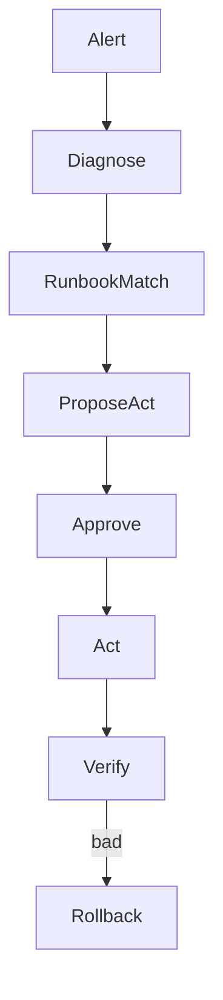

# Ops Agents

> Agents that diagnose and act on operational systems — metrics, logs, tickets, runbooks — under strict change control and verification loops.

## Table of Contents

- [Overview](#overview)
- [Definition](#definition)
- [Why It Matters](#why-it-matters)
- [Uses](#uses)
- [How It Works](#how-it-works)
- [Worked Example](#worked-example)
- [Python Examples](#python-examples)
- [Production Considerations](#production-considerations)
- [Performance Considerations](#performance-considerations)
- [Cost Considerations](#cost-considerations)
- [Security Considerations](#security-considerations)
- [Best Practices](#best-practices)
- [Common Mistakes](#common-mistakes)
- [Interview Preparation](#interview-preparation)
- [Navigation](#navigation)

---

## Overview

This lesson covers **Ops Agents** inside the `product-patterns` section of the `agentic-ai` handbook. Treat it as production engineering guidance: clear definitions, when to apply the idea, system shape, and code you can adapt.

---

## Definition

**Ops Agents** — Agents that diagnose and act on operational systems — metrics, logs, tickets, runbooks — under strict change control and verification loops.

---

## Why It Matters

Ops agents sit near production. Read-heavy autonomy is valuable; write actions need change windows, approvals, and automatic verify/rollback hooks.

Without a clear model for this topic, teams ship demos that fail under load, cost, or correctness pressure.

---

## Uses

| Use case | How this applies |
|----------|------------------|
| Triage | Classify incidents and gather context |
| Remediation | Execute approved runbook steps |
| Capacity | Recommend scale actions |
| Compliance ops | Collect evidence packs |

---

## How It Works

Bind actions to runbook ids. Verify with metrics, not model confidence. Page humans for novel failures outside the playbook library.



---

## Worked Example

Alert: payment latency p99 high. Agent pulls RED metrics, matches runbook 'dependency timeout,' proposes raise timeout + restart worker pool; human approves; agent verifies p99.

---

## Python Examples

```python
from dataclasses import dataclass, field
from typing import Callable

@dataclass
class Runbook:
    id: str
    match_signals: list[str]
    steps: list[str]
    verify_metric: str
    rollback: str

@dataclass
class OpsContext:
    alert: str
    signals: list[str]
    proposed_runbook: str | None = None
    approved: bool = False
    verification: dict = field(default_factory=dict)

def match_runbook(ctx: OpsContext, books: list[Runbook]) -> Runbook | None:
    for b in books:
        if any(sig in ctx.signals for sig in b.match_signals):
            return b
    return None

def execute_ops(
    ctx: OpsContext,
    book: Runbook,
    act: Callable[[str], None],
    read_metric: Callable[[str], float],
    threshold: float,
) -> OpsContext:
    if not ctx.approved:
        raise PermissionError("approval required")
    for step in book.steps:
        act(step)
    value = read_metric(book.verify_metric)
    ctx.verification = {"metric": book.verify_metric, "value": value}
    if value > threshold:
        act(book.rollback)
        ctx.verification["rolled_back"] = True
    return ctx

```

---

## Production Considerations

- Log request IDs across orchestration steps.
- Fail closed on auth and policy; degrade only where product explicitly allows it.
- Keep feature flags for prompt/model swaps.

## Performance Considerations

- Bound concurrency to the model provider.
- Stream when UX needs time-to-first-token.
- Cache stable sub-results carefully with invalidation rules.

## Cost Considerations

- Track tokens and tool calls per feature / tenant.
- Prefer smaller models for routers and classifiers.
- Cap max tokens and tool-loop iterations.

## Security Considerations

- Never put secrets in prompts.
- Treat model output as untrusted until validated.
- Enforce tenant isolation on retrieval and tools.

---

## Best Practices

1. Prefer explicit interfaces over prompt-only business logic.
2. Measure latency, cost, and quality together on every agent run.
3. Keep prompts, tool schemas, and configs versioned as one artifact.
4. Bound tool loops with max steps, wall-clock, and dollar budgets.
5. Log structured trajectories so failures are debuggable offline.

---

## Common Mistakes

- Shipping without golden trajectory evals.
- Hiding critical state only inside the model context window.
- No timeouts or budget limits on model or tool calls.
- Granting write tools before read-only autonomy is proven.
- Treating a chatbot with one tool as a production agentic system.

---

## Interview Preparation

**Q: How is agentic AI different from a chatbot?**

A: Chatbots optimize turn quality; agentic systems optimize goal completion via planning, tools, memory, and oversight under budgets.

**Q: What belongs in code vs the planner prompt?**

A: Auth, billing, validation, allow-lists, and kill-switches stay in code; stylistic planning heuristics can live in prompts.

**Q: How do you roll out higher autonomy safely?**

A: Start read-only, shadow write actions, gate on trajectory evals, canary a tenant slice, keep one-click rollback to lower autonomy.

---

## Navigation

- **Section hub:** [README](README.md)
- **Topic hub:** [../README.md](../README.md)
