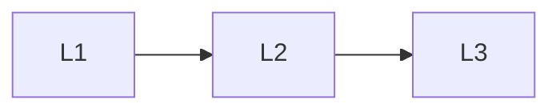

# Product Patterns

> Section of the **agentic-ai** handbook.

## Lessons

| # | Lesson |
|---|--------|
| 1 | [Research Agents](01-research-agents.md) |
| 2 | [Coding Agents](02-coding-agents.md) |
| 3 | [Ops Agents](03-ops-agents.md) |

**Topic hub:** [../README.md](../README.md)
