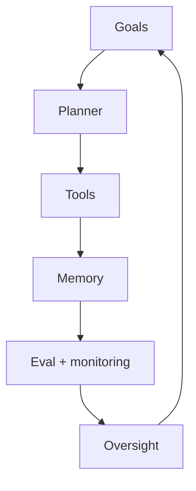

# Designing Agentic Systems

> An end-to-end design loop covering goals, planners, tools, memory, evaluation, and human oversight as first-class components — not afterthoughts.

## Table of Contents

- [Overview](#overview)
- [Definition](#definition)
- [Why It Matters](#why-it-matters)
- [Uses](#uses)
- [How It Works](#how-it-works)
- [Worked Example](#worked-example)
- [Python Examples](#python-examples)
- [Production Considerations](#production-considerations)
- [Performance Considerations](#performance-considerations)
- [Cost Considerations](#cost-considerations)
- [Security Considerations](#security-considerations)
- [Best Practices](#best-practices)
- [Common Mistakes](#common-mistakes)
- [Interview Preparation](#interview-preparation)
- [Navigation](#navigation)

---

## Overview

This lesson covers **Designing Agentic Systems** inside the `system-design` section of the `agentic-ai` handbook. Treat it as production engineering guidance: clear definitions, when to apply the idea, system shape, and code you can adapt.

---

## Definition

**Designing Agentic Systems** — An end-to-end design loop covering goals, planners, tools, memory, evaluation, and human oversight as first-class components — not afterthoughts.

---

## Why It Matters

Agent demos skip contracts between components. Production systems need explicit interfaces so you can swap models, tighten policy, and evaluate trajectories without rewriting the product.

Without a clear model for this topic, teams ship demos that fail under load, cost, or correctness pressure.

---

## Uses

| Use case | How this applies |
|----------|------------------|
| Greenfield agent | Start from goals and tool inventory, not from a framework |
| Brownfield app | Wrap existing APIs as tools with schemas and auth |
| Regulated | Oversight and audit as design inputs |
| Multi-tenant SaaS | Per-tenant budgets, memory isolation, policy packs |

---

## How It Works

Design in this order: success criteria → allowed tools → world state schema → planner/policy → eval suite → oversight UX. Frameworks are implementation details after contracts exist.



---

## Worked Example

Procurement agent: goal 'raise PO under policy'; tools ERP read + draft PO; memory holds vendor quotes; eval checks policy compliance; oversight approves POs over $5k.

---

## Python Examples

```python
from dataclasses import dataclass
from typing import Protocol, Any

class Tool(Protocol):
    name: str
    def schema(self) -> dict: ...
    def run(self, args: dict, ctx: dict) -> Any: ...

@dataclass
class AgenticDesign:
    goal_spec: str
    success_metrics: list[str]
    tools: list[str]
    memory_schema: dict
    autonomy_level: int
    eval_suite_id: str
    oversight: str  # none | approve_writes | approve_all

def validate_design(d: AgenticDesign) -> list[str]:
    gaps = []
    if not d.success_metrics:
        gaps.append("define_success_metrics")
    if not d.tools:
        gaps.append("tool_inventory")
    if "run_id" not in d.memory_schema.get("required", []):
        gaps.append("memory_needs_run_id")
    if d.autonomy_level >= 3 and d.oversight == "none":
        gaps.append("oversight_required_for_l3")
    if not d.eval_suite_id:
        gaps.append("eval_suite")
    return gaps

def skeleton_system_prompt(d: AgenticDesign) -> str:
    return (
        f"Goal: {d.goal_spec}\n"
        f"Allowed tools: {', '.join(d.tools)}\n"
        f"Stop when success metrics are met or you must refuse.\n"
        "Never invent tool results; use observations only."
    )

```

---

## Production Considerations

- Log request IDs across orchestration steps.
- Fail closed on auth and policy; degrade only where product explicitly allows it.
- Keep feature flags for prompt/model swaps.

## Performance Considerations

- Bound concurrency to the model provider.
- Stream when UX needs time-to-first-token.
- Cache stable sub-results carefully with invalidation rules.

## Cost Considerations

- Track tokens and tool calls per feature / tenant.
- Prefer smaller models for routers and classifiers.
- Cap max tokens and tool-loop iterations.

## Security Considerations

- Never put secrets in prompts.
- Treat model output as untrusted until validated.
- Enforce tenant isolation on retrieval and tools.

---

## Best Practices

1. Prefer explicit interfaces over prompt-only business logic.
2. Measure latency, cost, and quality together on every agent run.
3. Keep prompts, tool schemas, and configs versioned as one artifact.
4. Bound tool loops with max steps, wall-clock, and dollar budgets.
5. Log structured trajectories so failures are debuggable offline.

---

## Common Mistakes

- Shipping without golden trajectory evals.
- Hiding critical state only inside the model context window.
- No timeouts or budget limits on model or tool calls.
- Granting write tools before read-only autonomy is proven.
- Treating a chatbot with one tool as a production agentic system.

---

## Interview Preparation

**Q: How is agentic AI different from a chatbot?**

A: Chatbots optimize turn quality; agentic systems optimize goal completion via planning, tools, memory, and oversight under budgets.

**Q: What belongs in code vs the planner prompt?**

A: Auth, billing, validation, allow-lists, and kill-switches stay in code; stylistic planning heuristics can live in prompts.

**Q: How do you roll out higher autonomy safely?**

A: Start read-only, shadow write actions, gate on trajectory evals, canary a tenant slice, keep one-click rollback to lower autonomy.

---

## Navigation

- **Section hub:** [README](README.md)
- **Topic hub:** [../README.md](../README.md)
