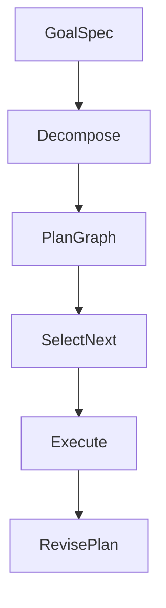

# Goals and Planners

> How to represent goals, decompose them into plans, and choose planner styles (reactive, hierarchical, LLM-as-planner) that fit risk and latency budgets.

## Table of Contents

- [Overview](#overview)
- [Definition](#definition)
- [Why It Matters](#why-it-matters)
- [Uses](#uses)
- [How It Works](#how-it-works)
- [Worked Example](#worked-example)
- [Python Examples](#python-examples)
- [Production Considerations](#production-considerations)
- [Performance Considerations](#performance-considerations)
- [Cost Considerations](#cost-considerations)
- [Security Considerations](#security-considerations)
- [Best Practices](#best-practices)
- [Common Mistakes](#common-mistakes)
- [Interview Preparation](#interview-preparation)
- [Navigation](#navigation)

---

## Overview

This lesson covers **Goals and Planners** inside the `system-design` section of the `agentic-ai` handbook. Treat it as production engineering guidance: clear definitions, when to apply the idea, system shape, and code you can adapt.

---

## Definition

**Goals and Planners** — How to represent goals, decompose them into plans, and choose planner styles (reactive, hierarchical, LLM-as-planner) that fit risk and latency budgets.

---

## Why It Matters

Vague goals produce wandering agents. Explicit goal schemas and planner contracts make progress measurable and failures attributable.

Without a clear model for this topic, teams ship demos that fail under load, cost, or correctness pressure.

---

## Uses

| Use case | How this applies |
|----------|------------------|
| Reactive | Cheap next-action selection each step |
| Hierarchical | Goal → subgoals → actions |
| LLM planner | Natural language plan then execute |
| Hybrid | Rules for policy; LLM for soft planning |

---

## How It Works

Store goals as structured objects (objective, constraints, success tests). Planners propose actions; a policy layer may rewrite or reject. Prefer revisable plans over one-shot mega-plans.



---

## Worked Example

Onboarding agent goal: {objective: 'activate account', constraints: ['KYC required'], success: ['status=active']}. Planner emits KYC → funding → activate; if KYC fails, revise to manual review.

---

## Python Examples

```python
from dataclasses import dataclass, field
from typing import Callable

@dataclass
class Goal:
    objective: str
    constraints: list[str] = field(default_factory=list)
    success_tests: list[str] = field(default_factory=list)

@dataclass
class PlanStep:
    id: str
    description: str
    tool: str | None = None
    depends_on: list[str] = field(default_factory=list)
    status: str = "pending"

def hierarchical_plan(goal: Goal) -> list[PlanStep]:
    # Deterministic skeleton; LLM may refine descriptions later.
    steps = [
        PlanStep("gather", "Collect required inputs", tool="read_profile"),
        PlanStep("check", "Validate constraints", tool="policy_check", depends_on=["gather"]),
        PlanStep("act", f"Execute: {goal.objective}", tool="primary_action", depends_on=["check"]),
        PlanStep("verify", "Run success tests", tool="verify", depends_on=["act"]),
    ]
    return steps

def next_ready(steps: list[PlanStep]) -> PlanStep | None:
    done = {s.id for s in steps if s.status == "done"}
    for s in steps:
        if s.status == "pending" and set(s.depends_on) <= done:
            return s
    return None

def revise_on_failure(steps: list[PlanStep], failed_id: str, note: str) -> list[PlanStep]:
    for s in steps:
        if s.id == failed_id:
            s.status = "failed"
            s.description += f" | fail: {note}"
    steps.append(PlanStep(f"recover_{failed_id}", f"Recover from {failed_id}", tool="escalate"))
    return steps

```

---

## Production Considerations

- Log request IDs across orchestration steps.
- Fail closed on auth and policy; degrade only where product explicitly allows it.
- Keep feature flags for prompt/model swaps.

## Performance Considerations

- Bound concurrency to the model provider.
- Stream when UX needs time-to-first-token.
- Cache stable sub-results carefully with invalidation rules.

## Cost Considerations

- Track tokens and tool calls per feature / tenant.
- Prefer smaller models for routers and classifiers.
- Cap max tokens and tool-loop iterations.

## Security Considerations

- Never put secrets in prompts.
- Treat model output as untrusted until validated.
- Enforce tenant isolation on retrieval and tools.

---

## Best Practices

1. Prefer explicit interfaces over prompt-only business logic.
2. Measure latency, cost, and quality together on every agent run.
3. Keep prompts, tool schemas, and configs versioned as one artifact.
4. Bound tool loops with max steps, wall-clock, and dollar budgets.
5. Log structured trajectories so failures are debuggable offline.

---

## Common Mistakes

- Shipping without golden trajectory evals.
- Hiding critical state only inside the model context window.
- No timeouts or budget limits on model or tool calls.
- Granting write tools before read-only autonomy is proven.
- Treating a chatbot with one tool as a production agentic system.

---

## Interview Preparation

**Q: How is agentic AI different from a chatbot?**

A: Chatbots optimize turn quality; agentic systems optimize goal completion via planning, tools, memory, and oversight under budgets.

**Q: What belongs in code vs the planner prompt?**

A: Auth, billing, validation, allow-lists, and kill-switches stay in code; stylistic planning heuristics can live in prompts.

**Q: How do you roll out higher autonomy safely?**

A: Start read-only, shadow write actions, gate on trajectory evals, canary a tenant slice, keep one-click rollback to lower autonomy.

---

## Navigation

- **Section hub:** [README](README.md)
- **Topic hub:** [../README.md](../README.md)
