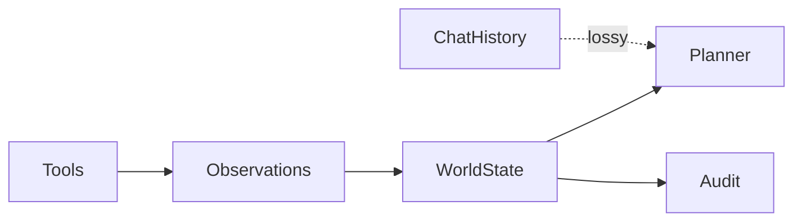

# World State and Memory

> Durable, structured state that the agent reads and writes — distinct from raw chat history — covering working memory, episodic traces, and retrieved knowledge.

## Table of Contents

- [Overview](#overview)
- [Definition](#definition)
- [Why It Matters](#why-it-matters)
- [Uses](#uses)
- [How It Works](#how-it-works)
- [Worked Example](#worked-example)
- [Python Examples](#python-examples)
- [Production Considerations](#production-considerations)
- [Performance Considerations](#performance-considerations)
- [Cost Considerations](#cost-considerations)
- [Security Considerations](#security-considerations)
- [Best Practices](#best-practices)
- [Common Mistakes](#common-mistakes)
- [Interview Preparation](#interview-preparation)
- [Navigation](#navigation)

---

## Overview

This lesson covers **World State and Memory** inside the `system-design` section of the `agentic-ai` handbook. Treat it as production engineering guidance: clear definitions, when to apply the idea, system shape, and code you can adapt.

---

## Definition

**World State and Memory** — Durable, structured state that the agent reads and writes — distinct from raw chat history — covering working memory, episodic traces, and retrieved knowledge.

---

## Why It Matters

Context windows are not databases. If success depends on facts the model 'remembers,' you will lose them on truncation, retries, and multi-session work.

Without a clear model for this topic, teams ship demos that fail under load, cost, or correctness pressure.

---

## Uses

| Use case | How this applies |
|----------|------------------|
| Working memory | Current plan, open questions, tool scratchpad |
| Episodic | Prior runs and outcomes for the same entity |
| Semantic | Retrieved docs and policies |
| Entity store | CRM/order objects as source of truth |

---

## How It Works

Define a schema for world state. Update it after every tool call. Summarize into the prompt from state; do not treat the prompt as the only store. Isolate tenant memory hard.



---

## Worked Example

Travel agent stores {trip_id, travelers, holds[], constraints}. After fare search, write offers into state; planner picks from state, not from a 40-message thread.

---

## Python Examples

```python
from dataclasses import dataclass, field, asdict
from typing import Any
import json
import time

@dataclass
class WorldState:
    run_id: str
    goal: str
    entities: dict[str, Any] = field(default_factory=dict)
    plan: list[dict] = field(default_factory=list)
    observations: list[dict] = field(default_factory=list)
    flags: dict[str, bool] = field(default_factory=dict)

    def remember(self, kind: str, payload: Any) -> None:
        self.observations.append({
            "ts": time.time(), "kind": kind, "payload": payload,
        })

    def set_entity(self, key: str, value: Any) -> None:
        self.entities[key] = value

    def prompt_view(self, max_obs: int = 8) -> str:
        recent = self.observations[-max_obs:]
        return json.dumps({
            "goal": self.goal,
            "entities": self.entities,
            "plan": self.plan,
            "recent_observations": recent,
            "flags": self.flags,
        }, ensure_ascii=False)

class MemoryStore:
    def __init__(self):
        self._by_run: dict[str, WorldState] = {}

    def get(self, run_id: str) -> WorldState:
        return self._by_run[run_id]

    def save(self, state: WorldState) -> None:
        self._by_run[state.run_id] = state

    def export_audit(self, run_id: str) -> dict:
        return asdict(self._by_run[run_id])

```

---

## Production Considerations

- Log request IDs across orchestration steps.
- Fail closed on auth and policy; degrade only where product explicitly allows it.
- Keep feature flags for prompt/model swaps.

## Performance Considerations

- Bound concurrency to the model provider.
- Stream when UX needs time-to-first-token.
- Cache stable sub-results carefully with invalidation rules.

## Cost Considerations

- Track tokens and tool calls per feature / tenant.
- Prefer smaller models for routers and classifiers.
- Cap max tokens and tool-loop iterations.

## Security Considerations

- Never put secrets in prompts.
- Treat model output as untrusted until validated.
- Enforce tenant isolation on retrieval and tools.

---

## Best Practices

1. Prefer explicit interfaces over prompt-only business logic.
2. Measure latency, cost, and quality together on every agent run.
3. Keep prompts, tool schemas, and configs versioned as one artifact.
4. Bound tool loops with max steps, wall-clock, and dollar budgets.
5. Log structured trajectories so failures are debuggable offline.

---

## Common Mistakes

- Shipping without golden trajectory evals.
- Hiding critical state only inside the model context window.
- No timeouts or budget limits on model or tool calls.
- Granting write tools before read-only autonomy is proven.
- Treating a chatbot with one tool as a production agentic system.

---

## Interview Preparation

**Q: How is agentic AI different from a chatbot?**

A: Chatbots optimize turn quality; agentic systems optimize goal completion via planning, tools, memory, and oversight under budgets.

**Q: What belongs in code vs the planner prompt?**

A: Auth, billing, validation, allow-lists, and kill-switches stay in code; stylistic planning heuristics can live in prompts.

**Q: How do you roll out higher autonomy safely?**

A: Start read-only, shadow write actions, gate on trajectory evals, canary a tenant slice, keep one-click rollback to lower autonomy.

---

## Navigation

- **Section hub:** [README](README.md)
- **Topic hub:** [../README.md](../README.md)
