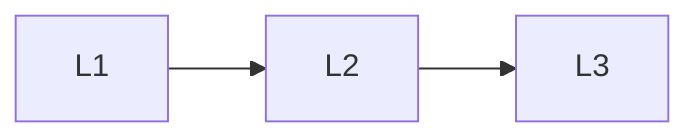

# System Design

> Section of the **agentic-ai** handbook.

## Lessons

| # | Lesson |
|---|--------|
| 1 | [Designing Agentic Systems](01-designing-agentic-systems.md) |
| 2 | [Goals and Planners](02-goals-and-planners.md) |
| 3 | [World State and Memory](03-world-state-and-memory.md) |

**Topic hub:** [../README.md](../README.md)
