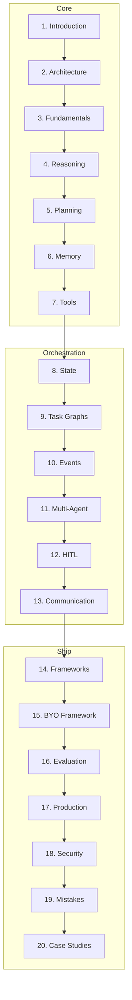

# AI Agents & Agent Engineering

> Comprehensive handbook for designing, orchestrating, evaluating, and scaling autonomous production agent systems.
> **Prerequisites:** [RAG](../rag/README.md) · [Context Engineering](../context-engineering/README.md) · [Prompt Engineering](../prompt-engineering/README.md)

---

## Module Overview

Agent engineering is an **independent software discipline** — not "LLMs with tools."

**Unlocks:** [MCP](../mcp/README.md) · [A2A](../a2a/README.md) · [Multi-Agent Systems](../multi-agent-systems/README.md)

---

## Documents (20 Sections)

| # | Topic | Document |
|---|-------|----------|
| 1 | Introduction | [introduction-to-agent-engineering.md](introduction-to-agent-engineering.md) |
| 2 | Agent Architecture | [agent-architecture.md](agent-architecture.md) |
| 3 | Fundamentals | [agent-fundamentals.md](agent-fundamentals.md) |
| 4 | Reasoning Patterns | [agent-reasoning-patterns.md](agent-reasoning-patterns.md) |
| 5 | Planning | [agent-planning.md](agent-planning.md) |
| 6 | Memory Systems | [agent-memory-systems.md](agent-memory-systems.md) |
| 7 | Tool Use | [tool-use.md](tool-use.md) |
| 8 | State Management | [agent-state-management.md](agent-state-management.md) |
| 9 | Task Graphs | [task-graphs.md](task-graphs.md) |
| 10 | Event-Driven Agents | [event-driven-agents.md](event-driven-agents.md) |
| 11 | Multi-Agent Systems | [multi-agent-systems.md](multi-agent-systems.md) |
| 12 | Human-in-the-Loop | [human-in-the-loop.md](human-in-the-loop.md) |
| 13 | Agent Communication | [agent-communication.md](agent-communication.md) |
| 14 | Frameworks | [frameworks/README.md](frameworks/README.md) |
| 15 | Build Your Own Framework | [build-your-own-agent-framework.md](build-your-own-agent-framework.md) |
| 16 | Agent Evaluation | [agent-evaluation.md](agent-evaluation.md) |
| 17 | Production | [production-agent-engineering.md](production-agent-engineering.md) |
| 18 | Security | [agent-security.md](agent-security.md) |
| 19 | Common Mistakes | [agent-engineering-mistakes.md](agent-engineering-mistakes.md) |
| 20 | Case Studies | [agent-case-studies.md](agent-case-studies.md) |

**Comparisons:** [agent-comparison-guides.md](agent-comparison-guides.md)

### Framework Guides (Section 14)

[LangGraph](frameworks/langgraph.md) · [CrewAI](frameworks/crewai.md) · [AutoGen](frameworks/autogen.md) · [Semantic Kernel](frameworks/semantic-kernel.md) · [PydanticAI](frameworks/pydantic-ai.md) · [OpenAI Agents SDK](frameworks/openai-agents-sdk.md)

---

## Code Examples

[`examples/agents/`](../../examples/agents/) — ReAct, tools, supervisor, debate, HITL, custom framework

---

## Cheat Sheets

- [Agent Lifecycle](../../cheat-sheets/agent-lifecycle-cheat-sheet.md)
- [Planning Checklist](../../cheat-sheets/agent-planning-checklist.md)
- [Memory Checklist](../../cheat-sheets/agent-memory-checklist.md)
- [Tool Design Checklist](../../cheat-sheets/agent-tool-design-checklist.md)
- [Multi-Agent Selection](../../cheat-sheets/multi-agent-architecture-selection-cheat-sheet.md)
- [Framework Selection](../../cheat-sheets/agent-framework-selection-cheat-sheet.md)
- [Production Deployment](../../cheat-sheets/agent-production-deployment-checklist.md)
- [Debugging Checklist](../../cheat-sheets/agent-debugging-checklist.md)

---

## Learning Path

1. **Foundations** — Introduction → Architecture → Fundamentals → Reasoning
2. **Capabilities** — Planning → Memory → Tools → State
3. **Orchestration** — Task Graphs → Events → Multi-Agent → HITL → Communication
4. **Implementation** — Frameworks → BYO Framework → Evaluation
5. **Production** — Production → Security → Mistakes → Case Studies

**Milestone:** ReAct agent with tool registry, checkpoints, HITL on writes, and scenario eval suite.

---

## Completion Checklist

- [ ] Read all 20 sections + 6 framework guides
- [ ] Implement ReAct loop with max-step guard
- [ ] Tool registry with schema validation
- [ ] Checkpoint state after each tool call
- [ ] HITL queue for destructive tools
- [ ] Golden task eval (≥20 scenarios)
- [ ] Review [agent mistakes](agent-engineering-mistakes.md)

---

## See Also

- [RAG](../rag/README.md) · [Agent Planning Template](../../prompts/templates/agent-planning.md)
- [Master Index](../../meta/indexes/MASTER-INDEX.md)
