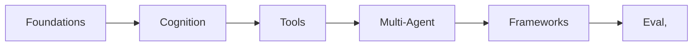

# AI Agents

> Agent engineering — reasoning, tools, memory, frameworks, security, and production.

**Prerequisites:** [LLM Application Development](../llm-application-development/README.md) · [Prompt Engineering](../prompt-engineering/README.md)  
**Unlocks:** [Agentic AI](../agentic-ai/README.md) · [MCP](../mcp/README.md) · [Multi-Agent Systems](../multi-agent-systems/README.md)

Thin lessons deepened 2026-08-12. Start with a section hub below (or expand the topic in the left sidebar).

---

## Sections

| # | Section | What you will learn | Hub |
|---|---------|---------------------|-----|
| 1 | **Foundations** | Intro and architecture | [foundations/](foundations/README.md) |
| 2 | **Cognition** | Reasoning, planning, memory | [cognition/](cognition/README.md) |
| 3 | **Tools & Action** | Tools, HITL, events | [tools-and-action/](tools-and-action/README.md) |
| 4 | **Multi-Agent Preview** | Pointer toward topic 20 | [multi-agent-preview/](multi-agent-preview/README.md) |
| 5 | **Frameworks** | LangGraph, CrewAI, … | [frameworks/](frameworks/README.md) |
| 6 | **Eval, Security & Production** | Ship and operate agents | [eval-security-production/](eval-security-production/README.md) |

```mermaid
flowchart LR
  S1[Foundations] --> S2[Cognition] --> S3[Tools] --> S4[Multi-Agent] --> S5[Frameworks] --> S6[Eval,]
```

---

## Hierarchy

### Foundations

| # | Topic |
|---|-------|
| 1 | [Introduction To Agent Engineering](foundations/01-introduction-to-agent-engineering.md) |
| 2 | [Agent Fundamentals](foundations/02-agent-fundamentals.md) |
| 3 | [Agent Architecture](foundations/03-agent-architecture.md) |

### Cognition

| # | Topic |
|---|-------|
| 1 | [Agent Reasoning Patterns](cognition/01-agent-reasoning-patterns.md) |
| 2 | [Agent Planning](cognition/02-agent-planning.md) |
| 3 | [Agent State Management](cognition/03-agent-state-management.md) |
| 4 | [Agent Memory Systems](cognition/04-agent-memory-systems.md) |
| 5 | [Task Graphs](cognition/05-task-graphs.md) |

### Tools & Action

| # | Topic |
|---|-------|
| 1 | [Tool Use](tools-and-action/01-tool-use.md) |
| 2 | [Human In The Loop](tools-and-action/02-human-in-the-loop.md) |
| 3 | [Event Driven Agents](tools-and-action/03-event-driven-agents.md) |
| 4 | [Agent Communication](tools-and-action/04-agent-communication.md) |

### Multi-Agent Preview

| # | Topic |
|---|-------|
| 1 | [Multi Agent Systems](multi-agent-preview/01-multi-agent-systems.md) |

### Frameworks

| # | Topic |
|---|-------|
| 1 | [Autogen](frameworks/02-autogen.md) |
| 2 | [Crewai](frameworks/03-crewai.md) |
| 3 | [Langgraph](frameworks/04-langgraph.md) |
| 4 | [Openai Agents Sdk](frameworks/05-openai-agents-sdk.md) |
| 5 | [Pydantic Ai](frameworks/06-pydantic-ai.md) |
| 6 | [Semantic Kernel](frameworks/07-semantic-kernel.md) |

### Eval, Security & Production

| # | Topic |
|---|-------|
| 1 | [Agent Evaluation](eval-security-production/01-agent-evaluation.md) |
| 2 | [Agent Security](eval-security-production/02-agent-security.md) |
| 3 | [Agent Engineering Mistakes](eval-security-production/03-agent-engineering-mistakes.md) |
| 4 | [Production Agent Engineering](eval-security-production/04-production-agent-engineering.md) |
| 5 | [Agent Case Studies](eval-security-production/05-agent-case-studies.md) |
| 6 | [Agent Comparison Guides](eval-security-production/06-agent-comparison-guides.md) |
| 7 | [Build Your Own Agent Framework](eval-security-production/07-build-your-own-agent-framework.md) |

---

## Definition

**AI agents** are LLM systems that plan, use tools, maintain state, and pursue goals beyond a single completion.

---

## Related topics

- [Domains overview](../README.md)
- [Master Index](../../meta/indexes/MASTER-INDEX.md)
