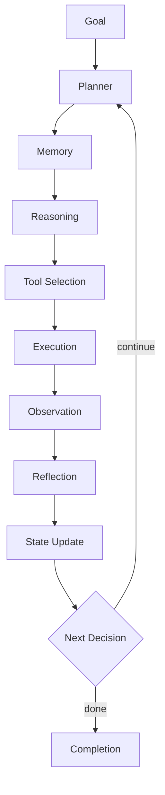

# Agent Architecture

> The canonical production agent stack — from goal intake through planning, execution, reflection, and completion.

## Overview

Section **2** of Phase 8.



## Components

| Component | Responsibility |
|-----------|----------------|
| **Goal** | User intent + success criteria + constraints |
| **Planner** | Decompose into steps/DAG; replan on failure |
| **Memory** | Working, episodic, semantic stores |
| **Reasoning** | LLM inference (ReAct, reflection) |
| **Tool Selection** | Choose tool + validated arguments |
| **Execution** | Run tool with timeout, retries, sandbox |
| **Observation** | Normalize tool output for context |
| **Reflection** | Critique progress; detect errors |
| **State Update** | Persist checkpoint; update scratchpad |
| **Next Decision** | Continue, replan, escalate, or complete |

## Clean Architecture Mapping

| Layer | Agent concern |
|-------|---------------|
| Domain | Goals, policies, tool contracts |
| Application | Agent orchestrator, planner |
| Infrastructure | LLM client, tool adapters, vector memory |
| Interface | API, WebSocket, queue consumer |

## Production Workflow

1. Validate goal and permissions
2. Load checkpoint if resuming
3. Enter loop with budget guards
4. Emit trace spans per step
5. Persist final state + audit log

## Reliability

- Idempotent tools where possible
- Circuit breakers on failing tools
- Dead-letter queue for stuck runs

## Python Sketch

```python
class AgentOrchestrator:
    async def step(self, state: AgentState) -> AgentState:
        plan = await self.planner.next(state)
        tool_call = await self.reasoner.select_tool(plan, state)
        observation = await self.executor.run(tool_call)
        reflection = await self.reflector.evaluate(state, observation)
        return state.update(observation, reflection)
```

## Navigation

- [Agent Fundamentals](agent-fundamentals.md) · [Agent Planning](agent-planning.md)

---

## Changelog

| Version | Date | Changes |
|---------|------|---------|
| 1.0 | 2026-07-13 | Phase 8 Section 2 |
