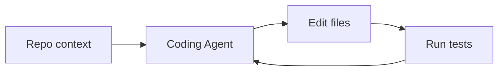

# Agent Case Studies

## Overview

Section **20** — **engineering patterns**, not proprietary internals.

## Coding Agents (Cursor, Copilot-class)

| Pattern | Description |
|---------|-------------|
| **Context** | Open files, LSP diagnostics, repo index (RAG) |
| **Loop** | Edit → run tests → observe errors → fix |
| **Tools** | File read/write, terminal, search |
| **Safety** | User approves diffs; sandboxed commands |

## Deep Research / Research Agents

- Multi-step search + synthesis
- Supervisor coordinates researcher + writer
- Citation requirements throughout
- Long-running with checkpoints

## Devin-class Autonomous SWE

- Planning phase → environment provisioning
- Long horizon; heavy HITL for production analogs
- Issue tracker integration as memory

## Customer Support Agents

- Router → KB RAG → ticket tools → escalation human
- Strict policy grounding; low temperature

## Operations Agents

- Event-driven (alerts → diagnose → remediate)
- Read-only default; write with approval
- Runbooks as procedural memory

## Navigation

- [Agent Comparison Guides](agent-comparison-guides.md)

---

## Changelog

| Version | Date | Changes |
|---------|------|---------|
| 1.0 | 2026-07-13 | Initial publication |
