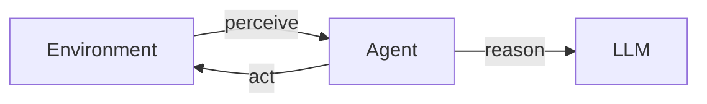

# Agent Fundamentals

## Overview

Section **3** of Phase 8 — vocabulary for engineering discussions.

## Core Concepts

| Concept | Definition |
|---------|------------|
| **Goal** | Desired end state (measurable) |
| **Task** | Unit of work toward goal |
| **Capability** | Tool or skill available |
| **Environment** | APIs, files, users, time |
| **Perception** | Inputs: messages, tool results, events |
| **Action** | Tool invocation or message |
| **Reasoning** | LLM decision step |
| **Feedback** | Observation → update beliefs |

## Decision Making

Agents decide: which tool, which args, whether to replan, whether to ask human, whether to stop.

## Iterative Improvement

Reflection loops use observations to correct course — see [Reasoning Patterns](agent-reasoning-patterns.md).

## Production Considerations

- Define success predicates in code, not only in prompts
- Cap action space via tool registry

## Interview Preparation

**Q: Define perception vs observation in agents.**

> Perception is any input channel. Observation is the structured result of a specific action returned to the agent loop.

## Navigation

- [Reasoning Patterns](agent-reasoning-patterns.md)

---

## Changelog

| Version | Date | Changes |
|---------|------|---------|
| 1.0 | 2026-07-13 | Phase 8 Section 3 |
