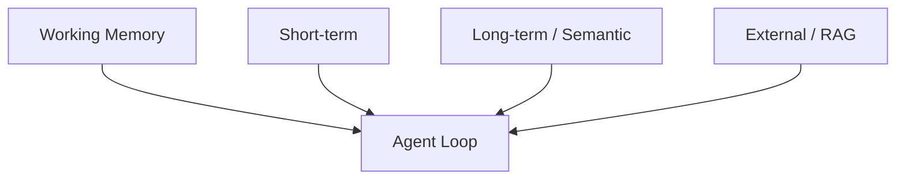

# Agent Memory Systems

## Overview

Section **6**. Agents need layered memory beyond conversation history.

| Type | Scope | Agent use |
|------|-------|-----------|
| **Working** | Current run scratchpad | Plan, observations |
| **Short-term** | Session | Recent tool results |
| **Episodic** | Past runs | "Last time we..." |
| **Semantic** | Facts | User prefs, domain facts |
| **Vector** | RAG recall | Knowledge retrieval tool |
| **Structured** | DB/JSON | Tickets, CRM records |
| **External** | Files, git | Codebase state |
| **Shared** | Multi-agent | Blackboard |

## Updates and Expiration

- Write episodic memory after successful task completion
- Compress working memory each N steps
- Never persist unvalidated LLM hallucinations

See [Context Engineering Memory](../context-engineering/memory-systems.md) for storage patterns.

## Navigation

- [Tool Use](tool-use.md)

---

## Changelog

| Version | Date | Changes |
|---------|------|---------|
| 1.0 | 2026-07-13 | Initial publication |
