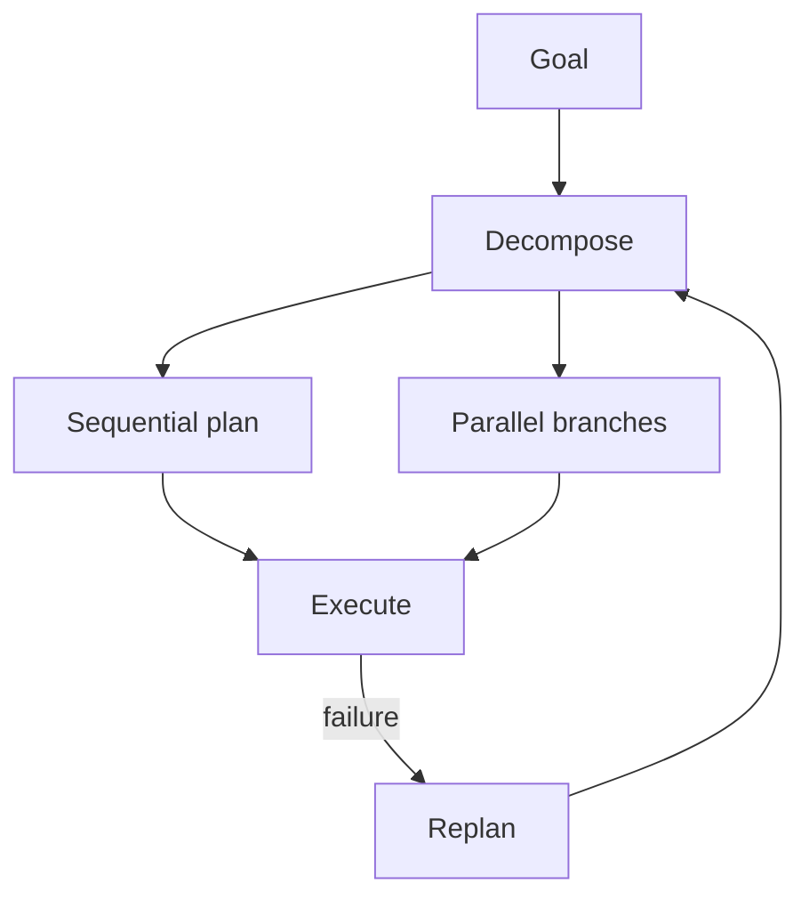

# Agent Planning

## Overview

Section **5** of Phase 8.



## Planning Types

| Type | When |
|------|------|
| **Sequential** | Steps depend on prior outputs |
| **Parallel** | Independent subtasks |
| **Dynamic** | Plan next step only (ReAct) |
| **Hierarchical** | High-level plan → sub-planners |
| **Adaptive** | Change strategy by observation |

## Execution Graphs

Plans map to DAGs — see [Task Graphs](task-graphs.md). Nodes = tool/LLM steps; edges = dependencies.

## Replanning Triggers

- Tool failure or timeout
- Validation error on output
- User correction
- Budget threshold

## Production Notes

- Validate plans against allowed tool set
- Store plan version in state for audit
- Use [agent planning template](../../prompts/templates/agent-planning.md)

## Python Example

```python
@dataclass
class PlanStep:
    id: str
    tool: str
    args: dict
    depends_on: list[str] = None

def topological_order(steps: list[PlanStep]) -> list[PlanStep]:
    # Kahn's algorithm simplified
    ...
```

## Navigation

- [Task Graphs](task-graphs.md)

---

## Changelog

| Version | Date | Changes |
|---------|------|---------|
| 1.0 | 2026-07-13 | Phase 8 Section 5 |
