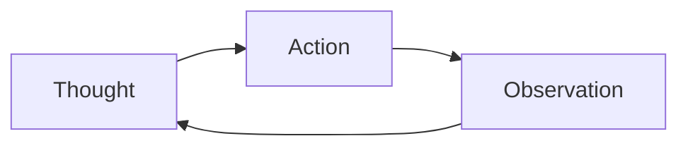
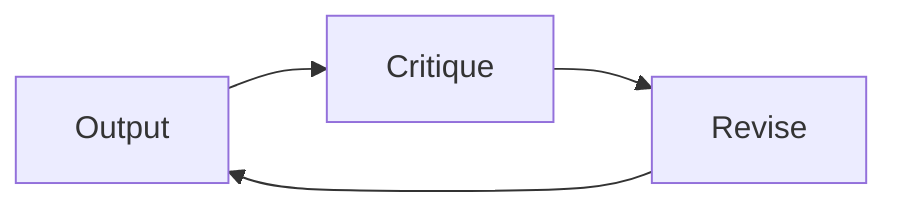

# Agent Reasoning Patterns

## Overview

Section **4**.

| Pattern | Flow | Production use |
|---------|------|----------------|
| **ReAct** | Thought → Action → Observation | Default tool loop |
| **Reflection** | Act → Critique → Revise | Quality-sensitive outputs |
| **Self-critique** | Generate → Score → Improve | Code, reports |
| **Planning** | Plan once → Execute steps | Multi-step tasks |
| **Replanning** | Observe failure → New plan | Robust ops |
| **Task decomposition** | Break goal into subtasks | Complex goals |
| **Tree of Thoughts** | Branch → Evaluate → Prune | Search problems |
| **Debate** | Multiple perspectives → Merge | High-stakes analysis |
| **Self-consistency** | Sample N → Majority vote | Reduce variance |

## ReAct Workflow



## Reflection Loop



## Tradeoffs

| Pattern | Cost | Latency | Reliability gain |
|---------|------|---------|------------------|
| ReAct | Medium | Medium | Baseline |
| Reflection | High | High | High for quality |
| ToT | Very high | Very high | Niche |

> **Production default:** ReAct + optional reflection on final artifact + explicit replan on tool failure.

## Python Example

```python
REACT_SYSTEM = """Think step by step. Format:
Thought: ...
Action: tool_name
Action Input: {...}
Stop with: Final Answer: ... when done."""
```

## Navigation

- [Agent Planning](agent-planning.md) · [Prompt Engineering Reasoning](../prompt-engineering/advanced-reasoning-strategies.md)

---

## Changelog

| Version | Date | Changes |
|---------|------|---------|
| 1.0 | 2026-07-13 | Initial publication |
