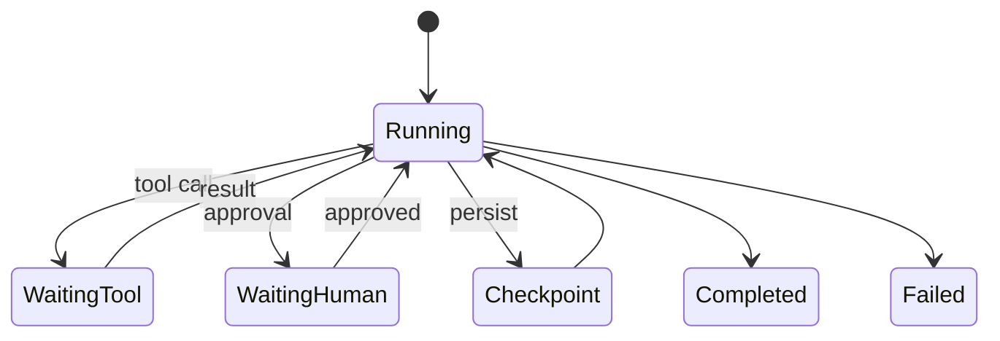

# Agent State Management

## Overview

Section **8** of Phase 8.



## State Types

| Type | Storage | TTL |
|------|---------|-----|
| **Agent state** | Run scratchpad, plan | Run duration |
| **Workflow state** | Orchestrator | Job duration |
| **Session** | Redis | Hours |
| **Persistent** | DB | Long-term |

## Checkpointing

Save after each tool call: `{run_id, step, messages, plan, artifacts}`. Enables resume after crash.

## Recovery

- Replay from last checkpoint
- Idempotent tool design required
- Rollback = restore checkpoint + invalidate downstream artifacts

## Python Example

```python
@dataclass
class AgentState:
    run_id: str
    step: int
    messages: list[dict]
    artifacts: dict[str, str]
    status: str = "running"
```

## Navigation

- [Task Graphs](task-graphs.md)

---

## Changelog

| Version | Date | Changes |
|---------|------|---------|
| 1.0 | 2026-07-13 | Phase 8 Section 8 |
