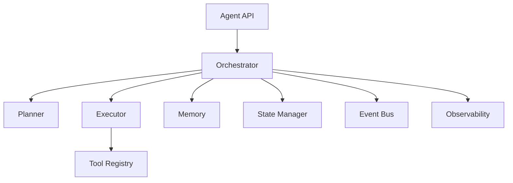

# Build Your Own Agent Framework

## Overview

Section **15** — minimal extensible framework (~200 lines core) before adopting LangGraph/CrewAI.

## Architecture



## Core Interfaces

```python
from abc import ABC, abstractmethod
from dataclasses import dataclass, field


@dataclass
class RunContext:
    run_id: str
    goal: str
    state: dict = field(default_factory=dict)
    step: int = 0


class Tool(ABC):
    name: str
    @abstractmethod
    async def run(self, **kwargs) -> str: ...


class Planner(ABC):
    @abstractmethod
    async def next_action(self, ctx: RunContext) -> dict: ...


class StateStore(ABC):
    @abstractmethod
    async def save(self, ctx: RunContext) -> None: ...
    @abstractmethod
    async def load(self, run_id: str) -> RunContext: ...


class AgentFramework:
    def __init__(self, planner, executor, tools: dict[str, Tool], state: StateStore, max_steps: int = 25):
        self.planner = planner
        self.executor = executor
        self.tools = tools
        self.state = state
        self.max_steps = max_steps

    async def run(self, goal: str, run_id: str) -> RunContext:
        ctx = RunContext(run_id=run_id, goal=goal)
        while ctx.step < self.max_steps:
            action = await self.planner.next_action(ctx)
            if action.get("type") == "finish":
                break
            obs = await self.executor.execute(self.tools[action["tool"]], action.get("args", {}))
            ctx.state.setdefault("observations", []).append(obs)
            ctx.step += 1
            await self.state.save(ctx)
        return ctx
```

## Extensions

- Event bus for `step_completed`, `tool_failed`
- Checkpoint after each step
- OpenTelemetry spans on planner/executor
- Permission middleware on tools

## When to Stop Building

Adopt LangGraph when you need: complex branching, built-in HITL interrupts, mature checkpoint backends.

## Navigation

- [Agent Evaluation](agent-evaluation.md)

---

## Changelog

| Version | Date | Changes |
|---------|------|---------|
| 1.0 | 2026-07-13 | Initial publication |
