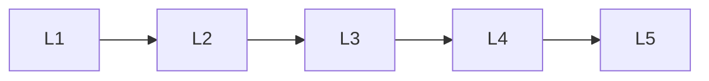

# Cognition

> Section of the **ai-agents** handbook.

## Lessons

| # | Lesson |
|---|--------|
| 1 | [Agent Reasoning Patterns](01-agent-reasoning-patterns.md) |
| 2 | [Agent Planning](02-agent-planning.md) |
| 3 | [Agent State Management](03-agent-state-management.md) |
| 4 | [Agent Memory Systems](04-agent-memory-systems.md) |
| 5 | [Task Graphs](05-task-graphs.md) |

**Topic hub:** [../README.md](../README.md)
