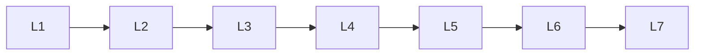

# Eval, Security & Production

> Section of the **ai-agents** handbook.

## Lessons

| # | Lesson |
|---|--------|
| 1 | [Agent Evaluation](01-agent-evaluation.md) |
| 2 | [Agent Security](02-agent-security.md) |
| 3 | [Agent Engineering Mistakes](03-agent-engineering-mistakes.md) |
| 4 | [Production Agent Engineering](04-production-agent-engineering.md) |
| 5 | [Agent Case Studies](05-agent-case-studies.md) |
| 6 | [Agent Comparison Guides](06-agent-comparison-guides.md) |
| 7 | [Build Your Own Agent Framework](07-build-your-own-agent-framework.md) |

**Topic hub:** [../README.md](../README.md)
