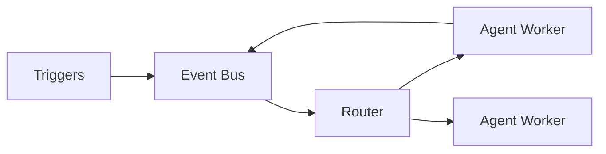

# Event-Driven Agents

## Overview

Section **10** of Phase 8.

## Patterns

| Pattern | Use case |
|---------|----------|
| **Webhook trigger** | Ticket created → support agent |
| **Queue consumer** | SQS/Kafka → agent job |
| **Pub/Sub** | Fan-out notifications |
| **Scheduled** | Cron maintenance agent |

## Production Architecture

- Durable queues (not in-memory only)
- At-least-once delivery + idempotent handlers
- Dead-letter queue for failed runs
- Correlation ID across events

## Navigation

- [Multi-Agent Systems](multi-agent-systems.md)

---

## Changelog

| Version | Date | Changes |
|---------|------|---------|
| 1.0 | 2026-07-13 | Phase 8 Section 10 |
