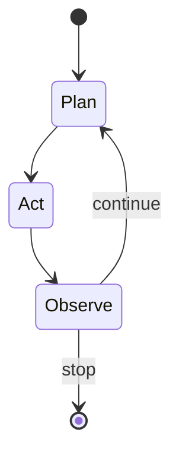

# Agent Fundamentals

> An **AI agent** is software that uses an LLM to pursue a goal by iteratively choosing actions (usually tools), observing results, and updating state until a stop condition.

## Definition

Agents combine:

| Piece | Role |
|-------|------|
| Goal | User intent + success criteria |
| Policy | LLM (plus rules) choosing next action |
| Tools | APIs, browsers, code runners, MCP servers |
| State | Memory of plan, artifacts, constraints |
| Stop | Budget, success predicate, human cancel |

They differ from **chatbots** (mostly reply-in-turn) and **pipelines** (fixed DAGs) by allowing open-ended control flow.

## Why it matters

Products like coding assistants and research agents need tool use and multi-step reasoning. Without fundamentals you ship unbounded loops, unsafe tools, or "agents" that are only prompts.

## Mental model



## Minimal loop (Python)

```python
from dataclasses import dataclass, field

@dataclass
class State:
    goal: str
    steps: list[str] = field(default_factory=list)
    done: bool = False

def run(state: State, policy, tools, max_steps=8) -> State:
    for _ in range(max_steps):
        action = policy(state)
        if action is None:
            state.done = True
            break
        name, args = action
        obs = tools[name](**args)
        state.steps.append(f"{name}:{obs}")
    return state
```

## Design rules

1. Encode **success** and **budgets** in code, not only in the prompt.
2. Prefer few sharp tools over many vague ones.
3. Persist state so crashes can resume.
4. Default high-impact tools to human approval.

## Production / safety

- Kill switches and per-run token/$ caps.
- Audit logs for tool args/results (redacted).
- Sandbox code execution; never pass raw secrets into prompts.

## Interview

**Q: Agent vs workflow?** Use a workflow when the path is known; use an agent when the path must be discovered under constraints — still wrap agents in workflows for auth, billing, and SLAs.


## Autonomy levels (practical)

| Level | Behavior | Example |
|-------|----------|---------|
| L0 | Suggest only | Draft reply |
| L1 | Tools with approval | Send email after confirm |
| L2 | Bounded auto | Label tickets under rules |
| L3 | Broad auto | Risky — needs strong eval |

## Anti-patterns

- Calling every chatbot an agent
- No success predicate ("just keep going")
- Tools that return entire databases into context

## Starter path

1. [mini ReAct](../../../examples/agents/FROM_MINI_TO_STARTER.md)
2. [agent-starter template](../../../templates/engineering/agent-starter/README.md)
3. Add eval from [agent evaluation](../../ai-evaluation/surface-areas/03-agent-evaluation.md)

## Navigation

- [Introduction](01-introduction-to-agent-engineering.md) · [Architecture](03-agent-architecture.md)
- [Section hub](README.md) · [Agents hub](../README.md)
- Offline demo: [mini ReAct](../../../examples/agents/FROM_MINI_TO_STARTER.md)
