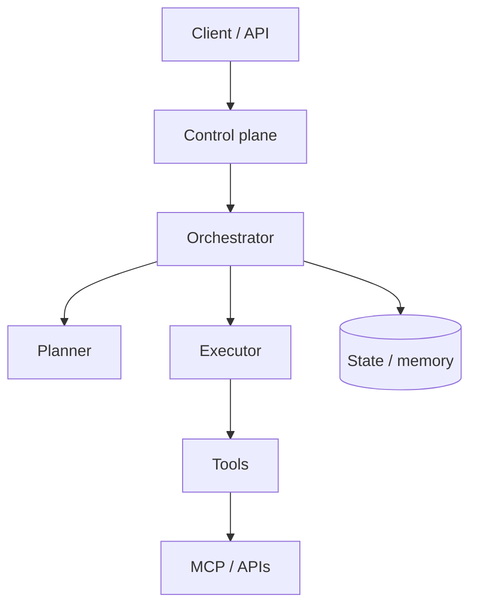

# Agent Architecture

> A practical layout separating **planning**, **execution**, **tools**, **memory**, and the **control plane** (auth, budgets, approvals).

## Layers



| Layer | Responsibility |
|-------|----------------|
| Control plane | Auth, tenant, budgets, kill switch, audit |
| Orchestrator | Loop, retries, checkpoints |
| Planner | Decompose goal / pick next action |
| Executor | Invoke tools, validate I/O |
| Memory | Short-term transcript + durable artifacts |
| Tools | Side effects with schemas |

## Why split layers

Keeps model swaps from rewriting auth; lets you test tools without an LLM; enables HITL interrupts without spaghetti.

## Checkpointing sketch

```python
def step(run_id: str, state: dict, store) -> dict:
    store.save(run_id, state)  # durable
    action = plan(state)
    if action.get("needs_approval"):
        return {"status": "paused", "action": action}
    state = execute(state, action)
    store.save(run_id, state)
    return state
```

## Failure modes

- God-object "Agent" class owning HTTP + SQL + prompts.
- Memory only in the context window (lost on crash).
- Tools without JSON schemas → injection and parse errors.

## Production checklist

- [ ] Idempotent tool calls where possible
- [ ] Per-tool timeouts
- [ ] Structured traces (run_id, step, tool)
- [ ] Resume from last checkpoint

## Interview

**Q: Where do you put policy?** Deterministic policy (authZ, spend) in the control plane; soft style policy in prompts — never the reverse for security.


## Deployment shapes

| Shape | When |
|-------|------|
| Sync API | Short tools, user waiting |
| Async worker | Long research / coding |
| Edge + cloud | Light plan locally, heavy tools remote |

## Observability minimum

- Trace id per run
- Span per tool
- Token and $ counters
- Pause/resume events for HITL

## Multi-agent boundary

When roles truly diverge (researcher vs writer vs reviewer), extract workers — otherwise keep a single agent with tools. See [Multi-Agent Systems](../../multi-agent-systems/README.md).

## Navigation

- [Fundamentals](02-agent-fundamentals.md) · [Tool use](../tools-and-action/01-tool-use.md)
- [Section hub](README.md) · [Agents hub](../README.md)
