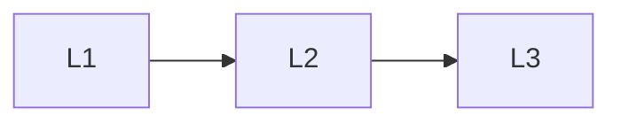

# Foundations

> Section of the **ai-agents** handbook.

## Lessons

| # | Lesson |
|---|--------|
| 1 | [Introduction To Agent Engineering](01-introduction-to-agent-engineering.md) |
| 2 | [Agent Fundamentals](02-agent-fundamentals.md) |
| 3 | [Agent Architecture](03-agent-architecture.md) |

**Topic hub:** [../README.md](../README.md)
