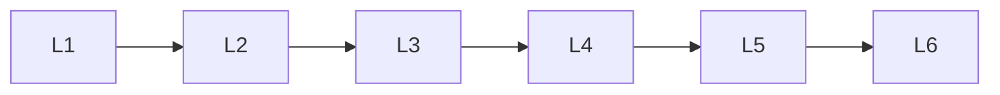

# Frameworks

> Section of the **ai-agents** handbook.

## Lessons

| # | Lesson |
|---|--------|
| 1 | [Autogen](02-autogen.md) |
| 2 | [Crewai](03-crewai.md) |
| 3 | [Langgraph](04-langgraph.md) |
| 4 | [Openai Agents Sdk](05-openai-agents-sdk.md) |
| 5 | [Pydantic Ai](06-pydantic-ai.md) |
| 6 | [Semantic Kernel](07-semantic-kernel.md) |

**Topic hub:** [../README.md](../README.md)
